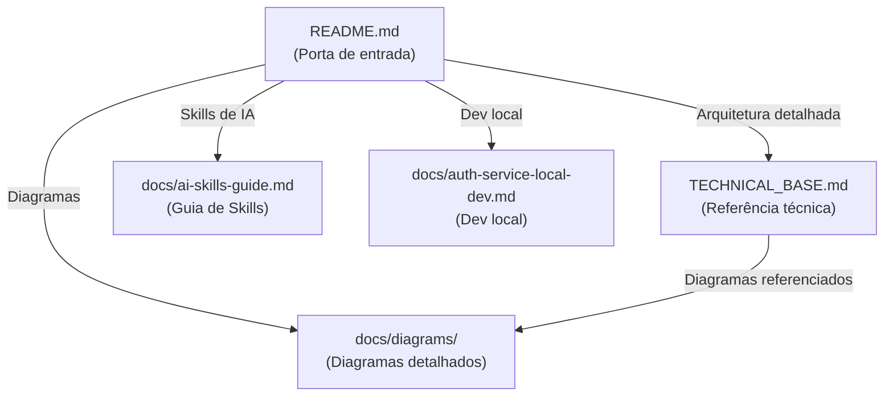

# Design — Melhoria da Documentação do Projeto

## Visão Geral

Este design define a estrutura, organização e templates para a melhoria completa da documentação do AI Project. O objetivo é transformar a documentação existente em um formato GitHub-friendly: visual, escaneável e navegável — priorizando tabelas, diagramas ASCII, progressive disclosure e hierarquia clara de headings.

O escopo é exclusivamente documentação (arquivos Markdown). Nenhuma alteração de código é necessária.

### Princípios de Design

| Princípio | Descrição |
|---|---|
| Minimal prose, maximum structure | Tabelas e diagramas substituem parágrafos longos |
| Progressive disclosure | Visão geral primeiro, detalhes via links |
| GitHub-native | Tudo renderiza na interface web do GitHub sem plugins |
| Single source of truth | TECHNICAL_BASE.md permanece como referência central; README.md é porta de entrada |
| Nomes descritivos | Arquivos de diagramas incluem o nome do pattern |

### Documentos Afetados

| Documento | Ação |
|---|---|
| `README.md` | Criar (novo) |
| `TECHNICAL_BASE.md` | Atualizar links, adicionar diagramas ASCII, simplificar seções |
| `docs/diagrams/*.md` | Renomear com nomes de patterns, adicionar diagramas ASCII |
| `docs/diagrams/README.md` | Atualizar índice com novos nomes |
| `.cursor/rules/project-base.mdc` | Atualizar links para novos nomes de diagramas |
| `docs/ai-skills-guide.md` | Criar (novo) — guia de skills de IA |

---

## Arquitetura

### Arquitetura da Documentação

A documentação segue uma hierarquia de 3 níveis com progressive disclosure:

```text
┌─────────────────────────────────────────────────┐
│                  README.md                       │
│         (Porta de entrada — visão macro)         │
│  ┌───────────┐  ┌──────────┐  ┌──────────────┐  │
│  │ Arquitetura│  │Quick Start│  │ Links p/ docs│  │
│  │  (ASCII)   │  │  (bash)   │  │  detalhados  │  │
│  └─────┬──────┘  └──────────┘  └──────┬───────┘  │
└────────┼──────────────────────────────┼──────────┘
         │                              │
         ▼                              ▼
┌─────────────────────┐  ┌──────────────────────────┐
│  TECHNICAL_BASE.md  │  │  docs/diagrams/*.md       │
│  (Referência central │  │  (Diagramas detalhados    │
│   — padrões, regras) │  │   Mermaid + ASCII)        │
└─────────────────────┘  └──────────────────────────┘
         │                              │
         ▼                              ▼
┌─────────────────────┐  ┌──────────────────────────┐
│ .cursor/rules/*.mdc │  │ .cursor/skills/*/SKILL.md │
│ (Regras para IA)    │  │ (Skills para IA)          │
└─────────────────────┘  └──────────────────────────┘
```

### Fluxo de Navegação



---

## Componentes e Interfaces

### Componente 1: README.md (Novo)

Porta de entrada visual do repositório. Estrutura:

```text
README.md
├── Visão Geral (3 frases + badge de status)
├── Arquitetura Macro (diagrama ASCII + Mermaid)
├── Quick Start (docker compose up)
├── Pré-requisitos (tabela: Ferramenta | Versão)
├── Stack de Tecnologia (tabela: Componente | Tecnologia | Papel)
├── Microsserviços (tabela: Serviço | Descrição | Stack | Status)
├── Estrutura do Repositório (árvore ASCII)
└── Documentação (tabela: Documento | Descrição | Link)
```

Template do diagrama ASCII de arquitetura macro:

```text
┌──────────┐  ┌──────────┐  ┌──────────┐
│  Web App │  │ Mobile   │  │ Desktop  │
└────┬─────┘  └────┬─────┘  └────┬─────┘
     │             │              │
     └──────┬──────┘──────┬───────┘
            │  HTTPS       │
            ▼              ▼
     ┌──────────────────────────┐
     │      Kong API Gateway    │
     │  (JWT, Rate Limit, SSL)  │
     └────────────┬─────────────┘
                  │
        ┌─────────┼─────────┐
        ▼         ▼         ▼
   ┌─────────┐ ┌─────────┐ ┌─────────┐
   │  auth   │ │  svc-A  │ │  svc-N  │
   │ service │ │         │ │         │
   └────┬────┘ └────┬────┘ └────┬────┘
        │           │           │
   ┌────┴────┐ ┌────┴────┐ ┌───┴─────┐
   │Keycloak │ │PostgreSQL│ │ MongoDB │
   │ + Redis │ │ + Redis  │ │ + Redis │
   └─────────┘ └──────────┘ └─────────┘
```

### Componente 2: Diagramas Renomeados

Mapeamento de renomeação dos arquivos de diagramas:

| Arquivo Atual | Novo Nome | Pattern |
|---|---|---|
| `architecture-overview.md` | `hexagonal-architecture-overview.md` | Hexagonal Architecture |
| `auth-login-flow.md` | `auth-ropc-login-flow.md` | ROPC (Resource Owner Password Credentials) |
| `auth-token-refresh.md` | `auth-token-refresh-flow.md` | Token Refresh |
| `auth-service-to-service.md` | `auth-client-credentials-s2s.md` | Client Credentials |
| `circuit-breaker-states.md` | `circuit-breaker-states.md` | Circuit Breaker (sem mudança) |
| `pubsub-event-flow.md` | `pubsub-event-flow.md` | Pub/Sub (sem mudança) |
| — (novo) | `auth-pkce-flow.md` | PKCE (Authorization Code + PKCE) |

Decisão: O fluxo PKCE atualmente está misturado no `auth-login-flow.md`. Será separado em arquivo próprio (`auth-pkce-flow.md`) para clareza, e o `auth-ropc-login-flow.md` ficará focado apenas no fluxo ROPC.

### Componente 3: Seção de Autenticação por Tipo de Cliente

Tabela de referência rápida a ser adicionada no TECHNICAL_BASE.md (seção 4):

| Tipo de Cliente | Fluxo OAuth 2.0 | Endpoint | Descrição |
|---|---|---|---|
| Web (browser) | Authorization Code + PKCE | `GET /authorize` → `GET /callback` | Fluxo seguro para SPAs sem client_secret exposto |
| Mobile (iOS/Android) | ROPC | `POST /login` | Login direto com username/password |
| Desktop/CLI (app) | ROPC | `POST /login` | Login direto com username/password |
| Service-to-Service | Client Credentials | Keycloak `/token` direto | Cada serviço com client_id/secret próprios |

### Componente 4: Validação em Duas Camadas (Kong + Microsserviço)

Diagrama ASCII do fluxo de validação:

```text
Request → ┌──────────────────────────────┐ → ┌──────────────────────────────┐
          │     Kong (OBRIGATÓRIA)       │   │  Microsserviço (OPCIONAL)    │
          │                              │   │                              │
          │  ✓ Assinatura JWT (JWKS)     │   │  ✓ Roles do domínio (RBAC)  │
          │  ✓ Expiração (exp)           │   │  ✓ Permissões específicas    │
          │  ✓ Emissor (iss)             │   │  ✓ Scopes do recurso        │
          │  ✓ Audiência (aud)           │   │                              │
          └──────────────────────────────┘   └──────────────────────────────┘
```

### Componente 5: Seção Kong API Gateway

Tabela de funcionalidades do Kong:

| Funcionalidade | Descrição | Plugin/Config |
|---|---|---|
| Roteamento | Direciona requests para microsserviços por path/host | Routes + Services |
| Validação JWT | Verifica assinatura, exp, iss, aud do token | `jwt` ou `openid-connect` |
| Rate Limiting | Limita requests por IP e por consumer | `rate-limiting` |
| SSL Termination | Gerencia certificados TLS | Configuração de listener |
| Correlation ID | Gera/propaga X-Correlation-ID | `correlation-id` |
| Request Transform | Adiciona headers de contexto (X-Consumer-ID) | `request-transformer` |

### Componente 6: Guia de Skills de IA (Novo)

Documento `docs/ai-skills-guide.md` com:

| Seção | Conteúdo |
|---|---|
| O que são Skills | Conceito, localização (.cursor/skills/), acionamento |
| Skills Disponíveis | Tabela: Skill \| O que faz \| Quando usar |
| Rules vs Skills | Tabela comparativa: Tipo \| Local \| Acionamento \| Descrição |
| Como escrever prompts | Checklist: Critério \| Descrição \| Exemplo |

### Componente 7: Revisão de Coerência

Checklist de validação a ser executado durante a implementação:

| Verificação | Fonte | Destino | Status |
|---|---|---|---|
| Links de diagramas | TECHNICAL_BASE.md | docs/diagrams/*.md | Verificar |
| Estrutura auth-service | TECHNICAL_BASE.md (seção 3.2) | auth-service/ real | Verificar |
| Endpoints documentados | api/openapi.yaml | handler.go | Verificar |
| Variáveis de ambiente | docker-compose.yml | config/config.go | Verificar |

Inconsistências já identificadas na pesquisa:
1. O TECHNICAL_BASE.md documenta a estrutura genérica hexagonal, mas o auth-service não tem `postgres/` nem `mongo/` — usa `keycloak/` e `redis/` como adapters. A documentação deve refletir isso.
2. O fluxo PKCE (web) e ROPC (mobile/app) estão misturados no mesmo diagrama `auth-login-flow.md`. Devem ser separados.
3. O `auth-login-flow.md` mostra apenas o fluxo ROPC (grant_type=password) no diagrama 4.1.a, mas o título sugere ser genérico. Precisa renomear e separar.

---

## Modelos de Dados

Como este é um projeto de documentação, não há modelos de dados tradicionais. Os "modelos" são os templates de estrutura dos documentos Markdown.

### Template: Arquivo de Diagrama

Cada arquivo em `docs/diagrams/` deve seguir esta estrutura:

```markdown
# [Nome do Pattern] — [Descrição Curta]

> Contexto: [Link para seção do TECHNICAL_BASE.md]

---

## Visão Geral

[1-2 frases descrevendo o que o diagrama mostra]

## Diagrama ASCII

` ` `text
[Diagrama ASCII do fluxo principal]
` ` `

## Diagrama Mermaid

` ` `mermaid
[Diagrama Mermaid complementar]
` ` `

## Parâmetros / Configuração

| Parâmetro | Valor | Descrição |
|---|---|---|

---

> Voltar ao índice: [README](README.md)
```

### Template: Seção do README.md

Cada seção do README segue o padrão:

```markdown
## [Título da Seção]

[Máximo 2 frases de contexto]

[Tabela ou diagrama ASCII — nunca parágrafo longo]

> Detalhes: [link para documento específico]
```

### Estrutura Final de Arquivos

```text
.
├── README.md                              ← NOVO
├── TECHNICAL_BASE.md                      ← ATUALIZADO (links, ASCII, auth por cliente)
├── docs/
│   ├── ai-skills-guide.md                 ← NOVO
│   ├── auth-service-local-dev.md          ← SEM MUDANÇA
│   ├── auth-service-history-2026-03-17.md ← SEM MUDANÇA
│   └── diagrams/
│       ├── README.md                      ← ATUALIZADO (índice com novos nomes)
│       ├── hexagonal-architecture-overview.md  ← RENOMEADO + ASCII adicionado
│       ├── auth-pkce-flow.md              ← NOVO (separado do login flow)
│       ├── auth-ropc-login-flow.md        ← RENOMEADO + focado em ROPC
│       ├── auth-token-refresh-flow.md     ← RENOMEADO
│       ├── auth-client-credentials-s2s.md ← RENOMEADO
│       ├── circuit-breaker-states.md      ← ASCII adicionado
│       └── pubsub-event-flow.md           ← ASCII adicionado
└── .cursor/
    ├── rules/
    │   └── project-base.mdc              ← ATUALIZADO (links)
    └── skills/                           ← SEM MUDANÇA nos arquivos
```


---

## Propriedades de Corretude

*Uma propriedade é uma característica ou comportamento que deve ser verdadeiro em todas as execuções válidas de um sistema — essencialmente, uma declaração formal sobre o que o sistema deve fazer. Propriedades servem como ponte entre especificações legíveis por humanos e garantias de corretude verificáveis por máquina.*

Como este é um projeto de documentação (arquivos Markdown), as propriedades de corretude focam na estrutura e integridade dos documentos, não em lógica de negócio.

### Property 1: Representações visuais usam blocos de código apropriados

*Para qualquer* arquivo Markdown no projeto que contenha um diagrama de fluxo, arquitetura ou estrutura de pastas, a representação visual deve estar dentro de um bloco de código com tag de linguagem (` ```text ` para ASCII, ` ```mermaid ` para Mermaid), nunca como texto solto ou lista com marcadores.

**Validates: Requirements 1.1, 1.5**

### Property 2: Hierarquia de headings é consistente

*Para qualquer* arquivo Markdown de documentação, os headings devem seguir uma hierarquia válida: h1 aparece no máximo uma vez (título do documento), h3 só aparece após um h2, e não há saltos de nível (ex: h1 → h3 sem h2 intermediário).

**Validates: Requirements 1.4**

### Property 3: Blocos de código possuem syntax highlighting

*Para qualquer* bloco de código em qualquer arquivo Markdown de documentação que contenha comandos shell, YAML, Go, JSON ou SQL, o bloco deve ter a tag de linguagem correspondente (` ```bash `, ` ```yaml `, ` ```go `, ` ```json `, ` ```sql `), nunca um bloco de código sem tag.

**Validates: Requirements 1.6**

### Property 4: Links internos usam caminhos relativos

*Para qualquer* link entre documentos Markdown dentro do repositório, o link deve usar caminho relativo (ex: `../docs/diagrams/file.md`), nunca URL absoluta ou caminho absoluto do filesystem.

**Validates: Requirements 1.9**

### Property 5: Links internos resolvem para arquivos existentes

*Para qualquer* link interno em qualquer arquivo Markdown do projeto que aponte para outro arquivo do repositório, o arquivo de destino deve existir no caminho especificado.

**Validates: Requirements 8.2, 9.1**

### Property 6: Nomes de arquivos de diagramas contêm o nome do pattern

*Para qualquer* arquivo de diagrama em `docs/diagrams/` (exceto `README.md`), o nome do arquivo deve conter o nome do pattern arquitetural ou fluxo que descreve (ex: `hexagonal`, `pkce`, `ropc`, `client-credentials`, `circuit-breaker`, `pubsub`).

**Validates: Requirements 4.5, 8.1**

---

## Tratamento de Erros

Como este é um projeto de documentação, não há tratamento de erros no sentido tradicional (exceções, HTTP status codes). Os "erros" são inconsistências na documentação.

### Tipos de Inconsistência

| Tipo | Descrição | Resolução |
|---|---|---|
| Link quebrado | Link aponta para arquivo que não existe | Atualizar link para o caminho correto |
| Estrutura divergente | Documentação descreve estrutura diferente do código real | Atualizar documentação para refletir o código |
| Endpoint ausente | Endpoint existe no código mas não na documentação | Adicionar endpoint na documentação |
| Variável de ambiente divergente | Variável documentada difere da usada no código | Atualizar documentação para refletir o código |
| Diagrama sem ASCII | Diagrama usa apenas Mermaid sem versão ASCII | Adicionar versão ASCII complementar |

### Regra de Resolução

Quando houver divergência entre documentação e código, o código é a fonte da verdade. A documentação deve ser atualizada para refletir o estado real do código (conforme Requisito 9.5).

---

## Estratégia de Testes

### Abordagem

Como este é um projeto de documentação, os testes são scripts de validação que verificam a estrutura e integridade dos arquivos Markdown. Usamos uma abordagem dual:

- **Testes unitários (exemplos)**: Verificam conteúdo específico de arquivos individuais (ex: README.md tem seção Quick Start, tabela de microsserviços tem colunas corretas)
- **Testes de propriedade**: Verificam regras universais que se aplicam a todos os arquivos de documentação (ex: todos os links internos resolvem, todos os blocos de código têm syntax highlighting)

### Biblioteca de Property-Based Testing

- **Linguagem**: Go (consistente com o projeto)
- **Biblioteca PBT**: `github.com/leanovate/gopter` (property-based testing para Go)
- **Alternativa**: Scripts de validação em Go usando `testing` + `filepath.Walk` para iterar sobre arquivos Markdown
- **Mínimo de iterações**: 100 por teste de propriedade (quando aplicável com geração de dados)

Para testes de documentação, a "geração de dados" é a iteração sobre todos os arquivos Markdown do repositório. Cada arquivo é um caso de teste.

### Testes de Propriedade

Cada propriedade do design deve ser implementada como um único teste:

| Propriedade | Teste | Tipo |
|---|---|---|
| Property 1: Visuais em blocos de código | Iterar sobre todos os .md, verificar que diagramas ASCII estão em ` ```text ` e Mermaid em ` ```mermaid ` | Property |
| Property 2: Hierarquia de headings | Iterar sobre todos os .md, parsear headings e verificar hierarquia válida | Property |
| Property 3: Syntax highlighting | Iterar sobre todos os .md, verificar que blocos de código com conteúdo reconhecível têm tag de linguagem | Property |
| Property 4: Links relativos | Iterar sobre todos os .md, extrair links internos e verificar que são relativos | Property |
| Property 5: Links resolvem | Iterar sobre todos os .md, extrair links internos e verificar que o arquivo destino existe | Property |
| Property 6: Nomes com pattern | Iterar sobre `docs/diagrams/`, verificar que cada arquivo (exceto README.md) contém nome de pattern | Property |

Tag format: **Feature: project-documentation-improvement, Property {number}: {property_text}**

### Testes Unitários (Exemplos)

| Teste | Arquivo | Verificação |
|---|---|---|
| README tem visão geral | README.md | Seção com descrição ≤ 3 frases |
| README tem diagrama ASCII | README.md | Bloco ` ```text ` com caracteres de box-drawing |
| README tem tabela de microsserviços | README.md | Tabela com colunas Serviço \| Descrição \| Stack \| Status |
| README tem Quick Start | README.md | Seção "Quick Start" com bloco ` ```bash ` |
| README tem tabela de stack | README.md | Tabela com colunas Componente \| Tecnologia \| Papel |
| README tem árvore de pastas | README.md | Bloco ` ```text ` com estrutura de árvore |
| README tem tabela de docs | README.md | Tabela com colunas Documento \| Descrição \| Link |
| README tem pré-requisitos | README.md | Tabela com colunas Ferramenta \| Versão Mínima |
| README tem Mermaid | README.md | Bloco ` ```mermaid ` |
| Auth tem tabela de fluxos | TECHNICAL_BASE.md | Tabela com colunas Tipo de Cliente \| Fluxo OAuth 2.0 \| Endpoint \| Descrição |
| Auth tem validação 2 camadas | TECHNICAL_BASE.md | Tabela com colunas Validação \| Onde \| Obrigatória \| O que verifica |
| Kong tem tabela funcionalidades | TECHNICAL_BASE.md | Tabela com colunas Funcionalidade \| Descrição \| Plugin/Config |
| Skills guide tem tabela | docs/ai-skills-guide.md | Tabela com colunas Skill \| O que faz \| Quando usar |
| Diagrams README tem índice | docs/diagrams/README.md | Tabelas agrupadas por categoria com todos os diagramas |
| Endpoints correspondem | api/openapi.yaml vs handler.go | Paths do OpenAPI existem como rotas no handler |
| Env vars correspondem | docker-compose.yml vs config.go | Variáveis do compose existem no config |
| Estrutura auth-service corresponde | TECHNICAL_BASE.md vs filesystem | Diretórios documentados existem |
