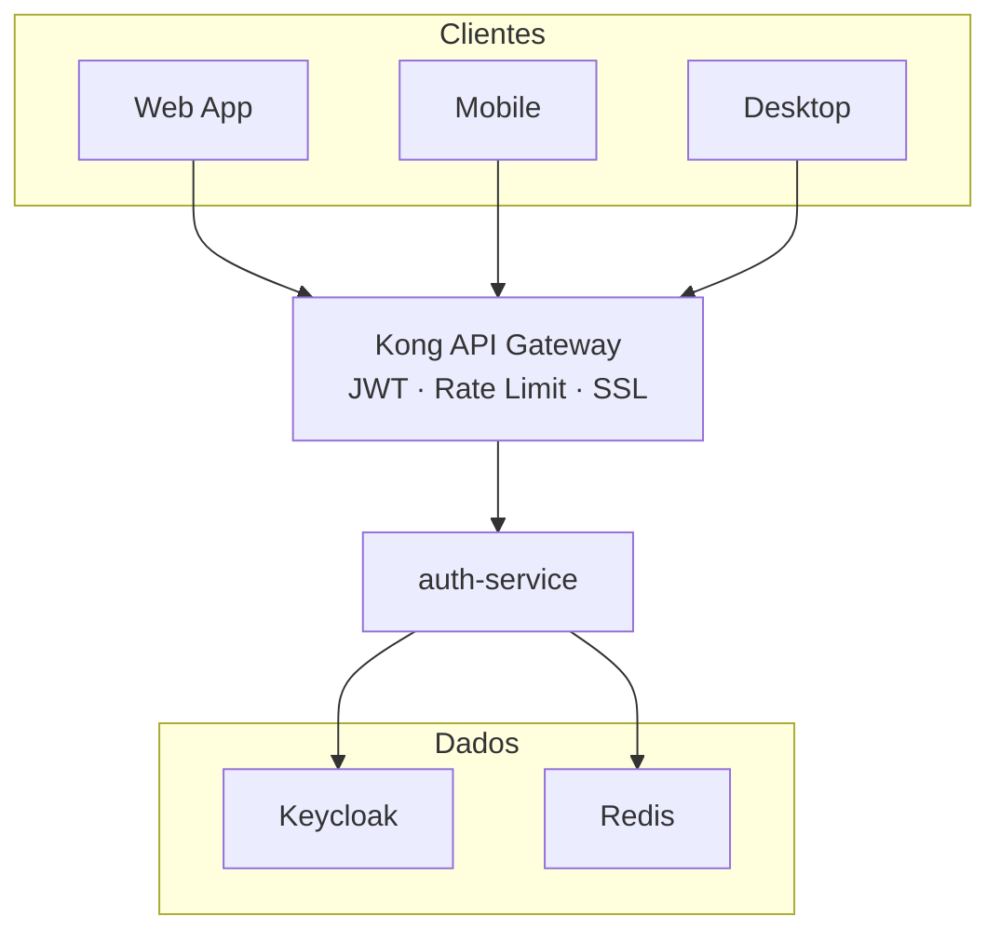

# AI Project

Backend de microsserviços em Go com autenticação centralizada via Keycloak, roteamento via Kong API Gateway e comunicação assíncrona via Redis Pub/Sub. O projeto segue Arquitetura Hexagonal (Ports & Adapters) com deploy containerizado via Docker Compose. Atualmente o `auth-service` é o primeiro microsserviço implementado, responsável pelos fluxos OAuth 2.0 (PKCE, ROPC e Client Credentials).

---

## Arquitetura Macro

```text
┌──────────┐  ┌──────────┐  ┌──────────┐
│  Web App │  │ Mobile   │  │ Desktop  │
└────┬─────┘  └────┬─────┘  └────┬─────┘
     │             │              │
     └──────┬──────┘──────┬───────┘
            │  HTTPS       │
            ▼              ▼
     ┌──────────────────────────┐
     │      Kong API Gateway    │
     │  (JWT, Rate Limit, SSL)  │
     └────────────┬─────────────┘
                  │
                  ▼
            ┌─────────┐
            │  auth   │
            │ service │
            └────┬────┘
                 │
           ┌─────┴─────┐
           ▼           ▼
      ┌─────────┐ ┌─────────┐
      │Keycloak │ │  Redis  │
      └─────────┘ └─────────┘
```



> Detalhes: [TECHNICAL_BASE.md](TECHNICAL_BASE.md) · [Diagrama Hexagonal](docs/diagrams/hexagonal-architecture-overview.md)

---

## Quick Start

### Pré-requisitos

| Ferramenta | Versão Mínima |
|---|---|
| Docker | 24.x |
| Docker Compose | 2.x (integrado ao Docker) |
| Go | 1.22+ |
| Git | 2.x |

### Subir o ambiente

```bash
# Clonar o repositório
git clone <repo-url> && cd ai-project

# Subir todos os serviços (build + start)
docker compose up --build
```

```bash
# Rodar em segundo plano
docker compose up --build -d
```

Aguarde até os serviços estarem saudáveis. Portas expostas:

| Serviço | Porta Local |
|---|---|
| Redis | `6379` |
| Keycloak (admin) | `8081` |
| auth-service | `8082` |

> Guia completo de desenvolvimento local: [docs/auth-service-local-dev.md](docs/auth-service-local-dev.md)

---

## Stack de Tecnologia

| Componente | Tecnologia | Papel |
|---|---|---|
| Linguagem | Go 1.22+ | Linguagem principal dos microsserviços |
| API Gateway | Kong | Roteamento, JWT, rate limiting, SSL termination |
| IAM | Keycloak 24.x | Emissão de tokens JWT, gerenciamento de usuários, RBAC |
| Cache / State | Redis 7 | Armazenamento de estado (PKCE), cache, Pub/Sub |
| Containerização | Docker + Compose | Build, deploy e orquestração local |
| Observabilidade | OpenTelemetry | Logs, métricas e traces distribuídos |

> Detalhes: [TECHNICAL_BASE.md — Stack](TECHNICAL_BASE.md#2-stack-de-tecnologia)

---

## Microsserviços

| Serviço | Descrição | Stack | Status |
|---|---|---|---|
| `auth-service` | Autenticação OAuth 2.0 (PKCE, ROPC, Client Credentials) | Go · Keycloak · Redis | ✅ Implementado |

---

## Estrutura do Repositório

```text
.
├── README.md                          # Porta de entrada (este arquivo)
├── TECHNICAL_BASE.md                  # Referência técnica central
├── docker-compose.yml                 # Orquestração local
├── auth-service/                      # Microsserviço de autenticação
│   ├── Dockerfile
│   ├── go.mod / go.sum
│   ├── api/
│   │   └── openapi.yaml               # Contrato OpenAPI
│   ├── cmd/
│   │   └── server/main.go             # Entrypoint
│   ├── config/
│   │   └── config.go                  # Configuração (env vars)
│   ├── internal/
│   │   ├── adapters/
│   │   │   ├── http/handler.go        # Handler HTTP (porta de entrada)
│   │   │   ├── keycloak/client.go     # Adapter Keycloak
│   │   │   └── redis/state_store.go   # Adapter Redis (state PKCE)
│   │   ├── application/               # Use cases (lógica de negócio)
│   │   ├── domain/                    # Entidades e erros de domínio
│   │   └── ports/
│   │       ├── input/handler.go       # Port de entrada
│   │       └── output/                # Ports de saída + mocks
│   └── pkg/
│       ├── apierror/errors.go         # Erros padronizados da API
│       └── middleware/                # Correlation, logging, tracing
├── docs/
│   ├── auth-service-local-dev.md      # Guia de dev local
│   ├── auth-service-history-*.md      # Histórico de decisões
│   └── diagrams/                      # Diagramas Mermaid + ASCII
│       ├── README.md                  # Índice de diagramas
│       ├── hexagonal-architecture-overview.md
│       ├── auth-pkce-flow.md
│       ├── auth-ropc-login-flow.md
│       ├── auth-token-refresh-flow.md
│       ├── auth-client-credentials-s2s.md
│       ├── circuit-breaker-states.md
│       └── pubsub-event-flow.md
└── .cursor/
    ├── rules/                         # Regras para agentes de IA
    └── skills/                        # Skills para agentes de IA
```

---

## Documentação

| Documento | Descrição | Link |
|---|---|---|
| Base Técnica | Referência central de arquitetura, padrões e convenções | [TECHNICAL_BASE.md](TECHNICAL_BASE.md) |
| Diagramas | Índice de diagramas de arquitetura e fluxos | [docs/diagrams/](docs/diagrams/) |
| Dev Local | Guia para subir o ambiente de desenvolvimento | [docs/auth-service-local-dev.md](docs/auth-service-local-dev.md) |
| Skills de IA | Guia de skills e rules para agentes de IA (Cursor) | [docs/ai-skills-guide.md](docs/ai-skills-guide.md) |
