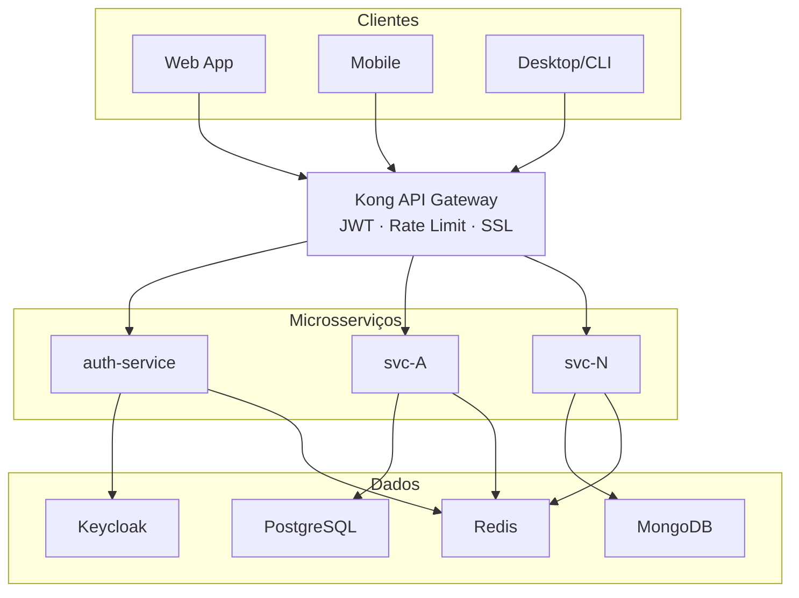
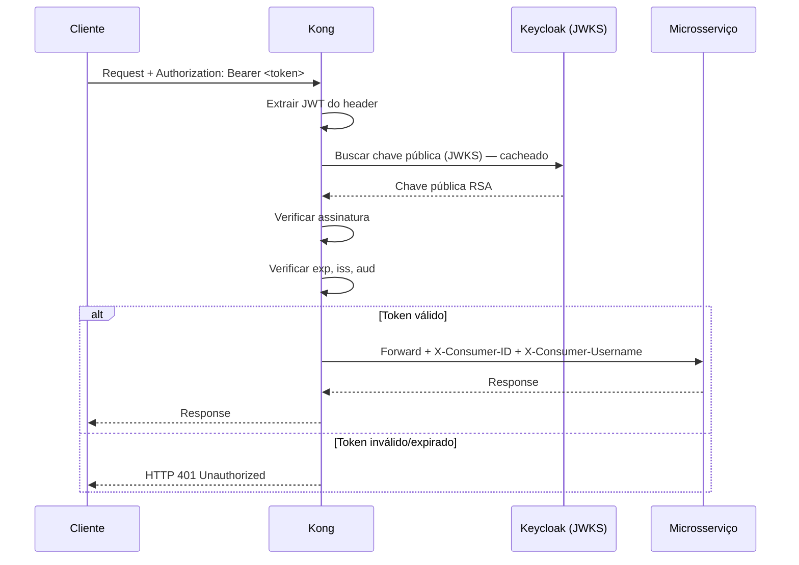

# Base Técnica do Projeto

> Versão: 1.0.0 | Última atualização: 2026-03-05

---

## Sumário

1. [Visão Geral](#1-visão-geral)
2. [Stack de Tecnologia](#2-stack-de-tecnologia)
3. [Arquitetura](#3-arquitetura)
4. [Autenticação e Autorização](#4-autenticação-e-autorização)
5. [Padrões de API REST](#5-padrões-de-api-rest)
6. [Padrões de Logging e Rastreabilidade](#6-padrões-de-logging-e-rastreabilidade)
7. [Padrões de Banco de Dados](#7-padrões-de-banco-de-dados)
8. [Requisitos Não-Funcionais](#8-requisitos-não-funcionais)
9. [Padrões de Codificação Go](#9-padrões-de-codificação-go)
10. [Referências](#10-referências)

---

## 1. Visão Geral

### 1.1 Objetivo

Este documento estabelece as bases técnicas e os padrões que devem ser seguidos por todos os times e agentes de desenvolvimento do projeto. Ele serve como referência central para decisões de arquitetura, escolhas de tecnologia, convenções de código e requisitos de qualidade.

### 1.2 Princípios Guia

| Princípio | Descrição |
|---|---|
| **Separação de responsabilidades** | Cada serviço possui um domínio bem definido e não deve conhecer a implementação interna de outros serviços. |
| **Design para falha** | Serviços devem ser resilientes a falhas de dependências externas (circuit breaker, retries com backoff, timeouts). |
| **Observabilidade desde o início** | Logs, métricas e traces são cidadãos de primeira classe, não afterthoughts. |
| **Segurança por padrão** | Autenticação, autorização e proteção de dados são obrigatórios em todos os endpoints. |
| **Imutabilidade de infraestrutura** | Configurações e infraestrutura são gerenciadas como código (IaC). |
| **API-first** | Contratos de API são definidos antes da implementação (OpenAPI/Swagger). |

### 1.3 Escopo

- Desenvolvimento de microsserviços backend em Go
- Comunicação síncrona via HTTP/REST e assíncrona via mensageria
- Autenticação centralizada com tokens JWT
- Observabilidade unificada via OpenTelemetry

---

## 2. Stack de Tecnologia

### 2.1 Tabela de Componentes

| Componente | Tecnologia | Papel | Versão Mínima |
|---|---|---|---|
| **API Gateway** | Kong | Roteamento, autenticação JWT, rate limiting, SSL termination | 3.x |
| **IAM / Identity** | Keycloak | Gerenciamento de usuários, emissão e validação de tokens JWT, RBAC | 24.x |
| **Linguagem principal** | Go (Golang) | Desenvolvimento dos microsserviços | 1.22+ |
| **Banco relacional** | PostgreSQL | Dados transacionais, consistência forte | 16.x |
| **Banco de documentos** | MongoDB | Dados semi-estruturados, documentos flexíveis | 7.x |
| **Cache / Fila** | Redis | Cache de dados, sessões, Pub/Sub de eventos | 7.x |
| **Observabilidade** | OpenTelemetry | Exportação de logs, métricas e traces | SDK Go 1.x |
| **Containerização** | Docker | Empacotamento e execução dos serviços | 24.x |
| **Orquestração** | Kubernetes | Deploy, escalonamento e resiliência | 1.29+ |

### 2.2 Bibliotecas Go Recomendadas

| Propósito | Biblioteca | Motivo |
|---|---|---|
| HTTP server | `net/http` + `chi` | Roteador leve, compatível com `net/http` padrão |
| Validação | `github.com/go-playground/validator/v10` | Validação declarativa via struct tags |
| ORM / SQL | `github.com/jackc/pgx/v5` | Driver nativo PostgreSQL de alto desempenho |
| MongoDB | `go.mongodb.org/mongo-driver/v2` | Driver oficial MongoDB |
| Redis | `github.com/redis/go-redis/v9` | Cliente Redis com suporte a Pub/Sub e Streams |
| JWT | `github.com/golang-jwt/jwt/v5` | Parse e validação de tokens JWT |
| Configuração | `github.com/spf13/viper` | Leitura de variáveis de ambiente e arquivos de config |
| Logging | `go.uber.org/zap` | Logger estruturado JSON de alto desempenho |
| OpenTelemetry | `go.opentelemetry.io/otel` | SDK oficial de observabilidade |
| Migrações DB | `github.com/golang-migrate/migrate/v4` | Migrações SQL versionadas |
| Testes | `github.com/stretchr/testify` | Assertions e mocks |

---

## 3. Arquitetura

### 3.1 Visão Macro

O sistema é composto por microsserviços independentes, comunicando-se de forma síncrona (REST via Kong) e assíncrona (Redis Pub/Sub). O acesso externo é sempre mediado pelo API Gateway.

#### Diagrama ASCII — Arquitetura Macro Simplificada

```text
┌──────────┐  ┌──────────┐  ┌──────────┐
│  Web App │  │ Mobile   │  │ Desktop  │
└────┬─────┘  └────┬─────┘  └────┬─────┘
     │             │              │
     └──────┬──────┘──────┬───────┘
            │  HTTPS       │
            ▼              ▼
     ┌──────────────────────────┐
     │      Kong API Gateway    │
     │  (JWT, Rate Limit, SSL)  │
     └────────────┬─────────────┘
                  │
        ┌─────────┼─────────┐
        ▼         ▼         ▼
   ┌─────────┐ ┌─────────┐ ┌─────────┐
   │  auth   │ │  svc-A  │ │  svc-N  │
   │ service │ │         │ │         │
   └────┬────┘ └────┬────┘ └────┬────┘
        │           │           │
   ┌────┴────┐ ┌────┴────┐ ┌───┴─────┐
   │Keycloak │ │PostgreSQL│ │ MongoDB │
   │ + Redis │ │ + Redis  │ │ + Redis │
   └─────────┘ └──────────┘ └─────────┘
```

#### Diagrama Mermaid — Arquitetura Macro Simplificada



#### Características de Microsserviços

| Característica | Descrição |
|---|---|
| Domínio independente | Cada serviço possui um bounded context bem definido |
| Deploy independente | Serviços são deployados e versionados de forma autônoma |
| Banco próprio | Cada serviço gerencia seu próprio banco de dados (database-per-service) |
| Comunicação via API | Interação síncrona via REST (Kong) e assíncrona via Redis Pub/Sub |
| Stateless | Estado de sessão armazenado em Redis ou banco, nunca no processo |
| Observabilidade | Logs, métricas e traces via OpenTelemetry |

#### Microsserviços Existentes

| Serviço | Pattern | Banco de Dados |
|---|---|---|
| auth-service | Hexagonal + DDD | Keycloak (IAM) + Redis (state/cache) |

> Diagrama de arquitetura completo (com observabilidade): [docs/diagrams/hexagonal-architecture-overview.md](docs/diagrams/hexagonal-architecture-overview.md)
>
> Inclui visão completa com subgraphs por camada (clientes, gateway, serviços, dados, observabilidade) e fluxo ponta a ponta de um request.

### 3.2 Padrão Arquitetural por Serviço: Hexagonal + DDD

Cada microsserviço segue a **Arquitetura Hexagonal (Ports & Adapters)** organizada em camadas de **Domain-Driven Design (DDD)**. Isso garante que a lógica de negócio seja completamente independente de frameworks, bancos de dados e protocolos de comunicação.

#### Camadas

| Camada | Diretório | Responsabilidade |
|---|---|---|
| **Domain** | `internal/domain/` | Entidades, Value Objects, agregados, regras de negócio puras. Sem dependências externas. |
| **Application** | `internal/application/` | Use cases / services de aplicação. Orquestram o domínio, chamam ports. |
| **Ports (in)** | `internal/ports/input/` | Interfaces que definem como o serviço é acionado (HTTP handlers, consumers de fila). |
| **Ports (out)** | `internal/ports/output/` | Interfaces que o domínio usa para se comunicar com o exterior (repositórios, filas, cache). |
| **Adapters** | `internal/adapters/` | Implementações concretas das ports (PostgreSQL, MongoDB, Redis, HTTP client). |

#### Estrutura de diretórios padrão

```text
service-name/
├── cmd/
│   └── server/
│       └── main.go              # Entrypoint: wiring de dependências (DI manual)
├── internal/
│   ├── domain/
│   │   ├── entity.go            # Entidades e agregados
│   │   ├── value_object.go      # Value objects imutáveis
│   │   └── errors.go            # Erros de domínio tipados
│   ├── application/
│   │   └── usecase.go           # Use cases com interfaces injetadas
│   ├── ports/
│   │   ├── input/
│   │   │   └── handler.go       # Interface do handler HTTP
│   │   └── output/
│   │       ├── repository.go    # Interface de repositório
│   │       └── publisher.go     # Interface de publicação de eventos
│   └── adapters/
│       ├── http/
│       │   └── handler.go       # Implementação HTTP (chi router)
│       ├── postgres/
│       │   └── repository.go    # Implementação PostgreSQL
│       ├── mongo/
│       │   └── repository.go    # Implementação MongoDB
│       └── redis/
│           ├── cache.go         # Implementação de cache
│           └── publisher.go     # Implementação de Pub/Sub
├── pkg/
│   ├── middleware/              # Middlewares reutilizáveis (auth, logging, tracing)
│   └── apierror/               # Tipos de erro HTTP padronizados
├── config/
│   └── config.go               # Leitura de configuração (viper)
├── migrations/
│   └── *.sql                   # Migrações de banco de dados versionadas
├── api/
│   └── openapi.yaml            # Contrato OpenAPI 3.0
├── Dockerfile
└── go.mod
```

> **Nota:** A estrutura acima é o template genérico. Cada serviço adapta os diretórios de `adapters/` conforme suas dependências reais. Por exemplo, o auth-service usa `keycloak/` e `redis/` como adapters (não `postgres/` nem `mongo/`):

```text
auth-service/
├── cmd/server/main.go
├── internal/
│   ├── domain/
│   │   ├── token.go
│   │   └── errors.go
│   ├── application/
│   │   ├── login_usecase.go
│   │   ├── authorize_usecase.go
│   │   ├── callback_usecase.go
│   │   ├── refresh_usecase.go
│   │   └── logout_usecase.go
│   ├── ports/
│   │   ├── input/handler.go
│   │   └── output/
│   │       ├── keycloak.go      # Interface para Keycloak
│   │       └── state_store.go   # Interface para state store (Redis)
│   └── adapters/
│       ├── http/handler.go      # Implementação HTTP (chi router)
│       ├── keycloak/client.go   # Implementação do client Keycloak
│       └── redis/state_store.go # Implementação do state store (Redis)
├── pkg/
│   ├── middleware/
│   └── apierror/
├── config/config.go
├── api/openapi.yaml
├── Dockerfile
└── go.mod
```

#### Regra de dependência

- `domain` não importa nada de fora do pacote
- `application` importa apenas `domain` e `ports/output`
- `adapters` implementam as interfaces definidas em `ports`
- `cmd/main.go` é o único local onde as dependências concretas são instanciadas e injetadas

> Diagrama visual da regra de dependência: [docs/diagrams/hexagonal-architecture-overview.md — Regra de Dependência](docs/diagrams/hexagonal-architecture-overview.md#regra-de-dependência--arquitetura-hexagonal)

### 3.3 Kong API Gateway

O Kong é o ponto de entrada único para todos os requests externos. Nenhum cliente acessa microsserviços diretamente.

#### Funcionalidades

| Funcionalidade | Descrição | Plugin/Config |
|---|---|---|
| Roteamento | Direciona requests para microsserviços por path/host | Routes + Services |
| Validação JWT | Verifica assinatura, exp, iss, aud do token | `jwt` ou `openid-connect` |
| Rate Limiting | Limita requests por IP e por consumer | `rate-limiting` |
| SSL Termination | Gerencia certificados TLS | Configuração de listener |
| Correlation ID | Gera/propaga X-Correlation-ID | `correlation-id` |
| Request Transform | Adiciona headers de contexto (X-Consumer-ID) | `request-transformer` |

#### Fluxo de Request pelo Kong

```text
Cliente
  │
  │ HTTPS
  ▼
┌─────────────────────────────────────────────┐
│                Kong API Gateway             │
│                                             │
│  1. SSL Termination                         │
│  2. Rate Limiting (IP / Consumer)           │
│  3. Correlation ID (gera se ausente)        │
│  4. Validação JWT (JWKS do Keycloak)        │
│  5. Adiciona headers (X-Consumer-ID, etc.)  │
│  6. Roteamento para microsserviço           │
│                                             │
│  ✗ Sem token → HTTP 401                     │
│  ✗ Token inválido → HTTP 401                │
│  ✗ Rate limit → HTTP 429                    │
└──────────────────┬──────────────────────────┘
                   │
                   ▼
            Microsserviço
```

#### Fluxo de Verificação JWT no Kong



#### Rate Limiting Padrão

| Tipo | Limite | Janela |
|---|---|---|
| Por IP (não autenticado) | 100 requests | 1 minuto |
| Por usuário autenticado | 1000 requests | 1 minuto |
| Por rota sensível (ex: /login) | 10 requests | 1 minuto |

### 3.4 Comunicação entre Serviços

#### Síncrona (REST)

- Usada para operações que precisam de resposta imediata
- Sempre passa pelo Kong API Gateway
- Autenticação via JWT em todo request inter-serviço
- Implementar **circuit breaker** e **retry com exponential backoff**

#### Assíncrona (Redis Pub/Sub)

- Usada para eventos de domínio que não necessitam de resposta síncrona
- Padrão de envelope de evento obrigatório:

```json
{
  "event_id": "uuid-v4",
  "event_type": "user.created",
  "source_service": "user-service",
  "timestamp": "2026-03-05T12:00:00Z",
  "correlation_id": "uuid-v4",
  "version": "1",
  "payload": { }
}
```

- Consumidores devem ser **idempotentes**: processar o mesmo evento múltiplas vezes deve produzir o mesmo resultado

> Diagrama detalhado: [docs/diagrams/pubsub-event-flow.md](docs/diagrams/pubsub-event-flow.md)

---

## 4. Autenticação e Autorização

### 4.0 Autenticação por Tipo de Cliente

| Tipo de Cliente | Fluxo OAuth 2.0 | Endpoint | Descrição |
|---|---|---|---|
| Web (browser) | Authorization Code + PKCE | `GET /authorize` → `GET /callback` | Fluxo seguro para SPAs sem client_secret exposto |
| Mobile (iOS/Android) | ROPC | `POST /login` | Login direto com username/password |
| Desktop/CLI (app) | ROPC | `POST /login` | Login direto com username/password |
| Service-to-Service | Client Credentials | Keycloak `/token` direto | Cada serviço com client_id/secret próprios |

> Diagramas detalhados: [PKCE](docs/diagrams/auth-pkce-flow.md) | [ROPC](docs/diagrams/auth-ropc-login-flow.md) | [Client Credentials](docs/diagrams/auth-client-credentials-s2s.md)

### 4.1 Fluxo de Autenticação

Os fluxos de autenticação são descritos em dois diagramas de sequência separados:

| Diagrama | Descrição |
|---|---|
| [auth-ropc-login-flow.md — 4.1.a](docs/diagrams/auth-ropc-login-flow.md) | Login do usuário: obtenção do `access_token` e `refresh_token` via Keycloak |
| [auth-ropc-login-flow.md — 4.1.b](docs/diagrams/auth-ropc-login-flow.md#41b--request-autenticado) | Request autenticado: validação JWT no Kong, verificação de roles no microsserviço |

### 4.2 Token JWT

#### Claims obrigatórias

```json
{
  "sub": "uuid-do-usuario",
  "iss": "https://keycloak.seudominio.com/realms/projeto",
  "aud": "nome-do-servico",
  "exp": 1234567890,
  "iat": 1234567890,
  "jti": "uuid-do-token",
  "realm_access": {
    "roles": ["role_name"]
  },
  "resource_access": {
    "service-name": {
      "roles": ["specific_permission"]
    }
  }
}
```

#### Regras de validação (obrigatórias em todo serviço)

1. Verificar assinatura do token com a chave pública do Keycloak (JWKS endpoint)
2. Verificar `exp` (token expirado é rejeitado)
3. Verificar `iss` (apenas tokens do realm correto são aceitos)
4. Verificar `aud` (token deve ser destinado ao serviço)
5. Verificar roles/scopes necessários para o endpoint acessado

#### Configuração no Kong

- Plugin `jwt` ou `openid-connect` habilitado por rota ou globalmente
- Rejeitar requests sem token com `HTTP 401`
- Rejeitar tokens inválidos ou expirados com `HTTP 401`
- Adicionar header `X-Consumer-ID` e `X-Consumer-Username` no forward

#### Renovação de Token (Refresh)

Quando o `access_token` expira, o cliente utiliza o `refresh_token` para obter um novo par de tokens sem exigir novo login.

> Diagrama detalhado: [docs/diagrams/auth-token-refresh-flow.md](docs/diagrams/auth-token-refresh-flow.md)

### 4.3 Autorização (RBAC)

- Roles e permissões definidas no Keycloak
- Microsserviços validam roles extraídas do JWT (sem chamar o Keycloak a cada request)
- Granularidade: `realm_access.roles` para permissões globais; `resource_access.<service>.roles` para permissões por serviço
- Exemplos de roles: `admin`, `read_only`, `service_account`

### 4.4 Service-to-Service

- Comunicação entre serviços usa **Client Credentials Flow** do OAuth 2.0
- Cada serviço tem um `client_id` e `client_secret` no Keycloak
- Token obtido via `POST /realms/{realm}/protocol/openid-connect/token` com `grant_type=client_credentials`
- Tokens de service accounts têm TTL curto (máx. 5 minutos)
- O token deve ser **cacheado localmente** pelo serviço chamador e reutilizado até próximo da expiração

> Diagrama detalhado: [docs/diagrams/auth-client-credentials-s2s.md](docs/diagrams/auth-client-credentials-s2s.md)

### 4.5 Validação em Duas Camadas (Kong + Microsserviço)

| Validação | Onde | Obrigatória | O que verifica |
|---|---|---|---|
| Assinatura JWT (JWKS) | Kong | Sim | Token foi assinado pelo Keycloak |
| Expiração (`exp`) | Kong | Sim | Token não está expirado |
| Emissor (`iss`) | Kong | Sim | Token é do realm correto |
| Audiência (`aud`) | Kong | Sim | Token é destinado ao serviço |
| Roles do domínio (RBAC) | Microsserviço | Recomendada | Usuário tem role necessária para o endpoint |
| Permissões específicas | Microsserviço | Recomendada | Scopes e permissões granulares do recurso |

```text
Request
  │
  ▼
┌──────────────────────────────────┐
│        Kong (OBRIGATÓRIA)        │
│                                  │
│  ✓ Assinatura JWT (JWKS)         │
│  ✓ Expiração (exp)               │
│  ✓ Emissor (iss)                 │
│  ✓ Audiência (aud)               │
│                                  │
│  ✗ Token inválido → HTTP 401     │
└──────────────┬───────────────────┘
               │ Token válido
               ▼
┌──────────────────────────────────┐
│  Microsserviço (OPCIONAL / RBAC) │
│                                  │
│  ✓ Roles do domínio              │
│  ✓ Permissões específicas        │
│  ✓ Scopes do recurso             │
│                                  │
│  ✗ Sem permissão → HTTP 403      │
└──────────────────────────────────┘
```

---

## 5. Padrões de API REST

### 5.1 Convenções de URL

| Regra | Correto | Incorreto |
|---|---|---|
| Recursos em plural | `/users` | `/user` |
| Minúsculas com hífen | `/user-profiles` | `/userProfiles` |
| Hierarquia com recurso pai | `/users/{id}/orders` | `/getUserOrders` |
| Sem verbos na URL | `GET /orders` | `GET /getOrders` |
| Versionamento no path | `/v1/users` | `/users?version=1` |

### 5.2 Métodos HTTP

| Método | Uso | Idempotente | Body |
|---|---|---|---|
| `GET` | Leitura de recurso(s) | Sim | Não |
| `POST` | Criação de recurso | Não | Sim |
| `PUT` | Substituição completa | Sim | Sim |
| `PATCH` | Atualização parcial | Não | Sim |
| `DELETE` | Remoção | Sim | Não |

### 5.3 Respostas HTTP

#### Códigos de status padrão

| Código | Situação |
|---|---|
| `200 OK` | Operação bem-sucedida com body |
| `201 Created` | Recurso criado com sucesso |
| `204 No Content` | Operação bem-sucedida sem body (ex: DELETE) |
| `400 Bad Request` | Dados de entrada inválidos |
| `401 Unauthorized` | Token ausente ou inválido |
| `403 Forbidden` | Token válido mas sem permissão |
| `404 Not Found` | Recurso não encontrado |
| `409 Conflict` | Conflito de estado (ex: duplicata) |
| `422 Unprocessable Entity` | Validação de negócio falhou |
| `429 Too Many Requests` | Rate limit atingido |
| `500 Internal Server Error` | Erro interno não esperado |

#### Envelope de resposta de erro (obrigatório)

```json
{
  "error": {
    "code": "VALIDATION_ERROR",
    "message": "O campo 'email' é obrigatório.",
    "details": [
      {
        "field": "email",
        "message": "campo obrigatório"
      }
    ],
    "trace_id": "abc123def456"
  }
}
```

#### Envelope de resposta de lista (paginada)

```json
{
  "data": [],
  "pagination": {
    "page": 1,
    "page_size": 20,
    "total_items": 150,
    "total_pages": 8
  }
}
```

### 5.4 Parâmetros de Paginação

| Parâmetro | Tipo | Padrão | Máximo | Descrição |
|---|---|---|---|---|
| `page` | int | 1 | — | Número da página (base 1) |
| `page_size` | int | 20 | 100 | Itens por página |
| `sort_by` | string | — | — | Campo de ordenação |
| `sort_order` | string | `asc` | — | `asc` ou `desc` |

### 5.5 Headers Obrigatórios

| Header | Direção | Descrição |
|---|---|---|
| `Authorization: Bearer <token>` | Request | Token JWT |
| `Content-Type: application/json` | Request/Response | Formato do body |
| `X-Request-ID` | Request | ID único do request (UUID v4) — gerado pelo cliente ou Kong |
| `X-Correlation-ID` | Request/Response | ID de correlação para rastreamento distribuído |

### 5.6 Versionamento

- Versão maior no path: `/v1/`, `/v2/`
- Versões anteriores mantidas por no mínimo 6 meses após o release da próxima
- Breaking changes sempre implicam nova versão maior
- Mudanças retrocompatíveis (campos opcionais, novos endpoints) não necessitam nova versão

### 5.7 Contrato OpenAPI

- Todo serviço deve manter um arquivo `api/openapi.yaml` na raiz do repositório
- Spec OpenAPI 3.0+
- Deve ser gerado ou validado em CI/CD
- Incluir exemplos de request e response para cada endpoint

---

## 6. Padrões de Logging e Rastreabilidade

### 6.1 Princípios

- Todos os logs devem ser em **formato JSON estruturado**
- Nunca logar dados sensíveis: senhas, tokens completos, PII (CPF, cartão)
- Nível de log configurável via variável de ambiente (`LOG_LEVEL`)
- Usar `go.uber.org/zap` como biblioteca de logging

### 6.2 Níveis de Log

| Nível | Quando usar |
|---|---|
| `DEBUG` | Detalhes de execução úteis para desenvolvimento. Desabilitado em produção. |
| `INFO` | Eventos normais do ciclo de vida do serviço (start, stop, request recebido). |
| `WARN` | Situações anômalas que não impedem o funcionamento mas merecem atenção. |
| `ERROR` | Erros que impedem uma operação mas não derrubam o serviço. |
| `FATAL` | Erros irrecuperáveis. O processo é encerrado após o log. |

### 6.3 Campos Obrigatórios em Todo Log

```json
{
  "timestamp": "2026-03-05T12:00:00.000Z",
  "level": "info",
  "service": "user-service",
  "version": "1.2.3",
  "trace_id": "abc123",
  "span_id": "def456",
  "correlation_id": "uuid-do-request",
  "message": "descrição do evento"
}
```

### 6.4 Campos Adicionais por Contexto

**Request HTTP:**
```json
{
  "http.method": "POST",
  "http.path": "/v1/users",
  "http.status_code": 201,
  "http.duration_ms": 42,
  "http.request_id": "uuid"
}
```

**Erro:**
```json
{
  "error.type": "DatabaseError",
  "error.message": "connection refused",
  "error.stack": "..."
}
```

**Evento de negócio:**
```json
{
  "event.type": "user.created",
  "entity.type": "user",
  "entity.id": "uuid-do-usuario"
}
```

### 6.5 OpenTelemetry — Instrumentação

Todo microsserviço deve ser instrumentado com os três pilares de observabilidade:

#### Traces

- Criar um span raiz para cada request HTTP recebido
- Criar spans filhos para cada chamada a banco de dados, cache, fila ou serviço externo
- Propagar contexto de trace via headers `traceparent` e `tracestate` (W3C Trace Context)
- Incluir atributos nos spans: `http.method`, `http.route`, `db.system`, `db.statement` (sem dados sensíveis)

```go
// Exemplo de instrumentação de handler
ctx, span := tracer.Start(r.Context(), "handler.CreateUser")
defer span.End()

span.SetAttributes(
    attribute.String("user.email_domain", domain),
)
```

#### Métricas (obrigatórias por serviço)

| Métrica | Tipo | Descrição |
|---|---|---|
| `http_requests_total` | Counter | Total de requests por método, rota e status |
| `http_request_duration_seconds` | Histogram | Latência dos requests HTTP |
| `db_query_duration_seconds` | Histogram | Latência de queries ao banco |
| `cache_hits_total` | Counter | Hits no cache Redis |
| `cache_misses_total` | Counter | Misses no cache Redis |
| `queue_messages_published_total` | Counter | Mensagens publicadas no Pub/Sub |
| `queue_messages_consumed_total` | Counter | Mensagens consumidas do Pub/Sub |

#### Logs

- Exportar logs via OpenTelemetry Log SDK (correlacionados com trace_id e span_id)
- Configurar o exportador via variáveis de ambiente (`OTEL_EXPORTER_OTLP_ENDPOINT`)

### 6.6 Correlation ID

- Todo request deve ter um `X-Correlation-ID` (gerado pelo Kong se não enviado pelo cliente)
- O `correlation_id` deve ser propagado em todos os logs, spans e mensagens de fila do fluxo
- Em chamadas HTTP inter-serviço, incluir o header `X-Correlation-ID` no request de saída

---

## 7. Padrões de Banco de Dados

### 7.1 PostgreSQL

#### Nomenclatura

| Objeto | Convenção | Exemplo |
|---|---|---|
| Tabela | `snake_case` plural | `user_accounts` |
| Coluna | `snake_case` | `created_at` |
| Índice | `idx_<tabela>_<colunas>` | `idx_users_email` |
| Chave estrangeira | `fk_<tabela>_<coluna>` | `fk_orders_user_id` |
| Constraint única | `uq_<tabela>_<colunas>` | `uq_users_email` |

#### Colunas padrão obrigatórias

Toda tabela deve ter as seguintes colunas:

```sql
id          UUID        PRIMARY KEY DEFAULT gen_random_uuid(),
created_at  TIMESTAMPTZ NOT NULL DEFAULT NOW(),
updated_at  TIMESTAMPTZ NOT NULL DEFAULT NOW(),
deleted_at  TIMESTAMPTZ             -- soft delete (NULL = não deletado)
```

#### Migrações

- Toda alteração de schema deve ser feita via migration versionada com `golang-migrate`
- Nomenclatura do arquivo: `{versao}_{descricao}.up.sql` e `{versao}_{descricao}.down.sql`
- Exemplo: `000001_create_users_table.up.sql`
- Migrações nunca devem ser editadas após aplicadas em produção
- Executar migrações no startup do serviço ou via job dedicado em CI/CD

#### Transações

- Usar transações para operações que modificam múltiplas tabelas
- Timeout máximo por transação: 30 segundos
- Nunca fazer chamadas a serviços externos dentro de uma transação

#### Connection Pool

```go
// Configuração recomendada pgx
pool, _ := pgxpool.New(ctx, connString)
pool.Config().MaxConns = 20
pool.Config().MinConns = 5
pool.Config().MaxConnLifetime = 30 * time.Minute
pool.Config().MaxConnIdleTime = 5 * time.Minute
```

### 7.2 MongoDB

#### Quando usar

- Documentos com estrutura variável ou nested complexa
- Dados de log, eventos, configurações dinâmicas
- Workloads com alto volume de leitura e escrita de documentos inteiros

#### Nomenclatura

| Objeto | Convenção | Exemplo |
|---|---|---|
| Database | `snake_case` | `notification_service` |
| Collection | `snake_case` plural | `notification_logs` |
| Campo | `snake_case` | `sent_at` |

#### Campos padrão obrigatórios

```json
{
  "_id": "ObjectId ou UUID",
  "created_at": "ISODate",
  "updated_at": "ISODate"
}
```

#### Índices

- Criar índices para todos os campos usados em queries de filtro
- Usar índices compostos quando a query filtra por múltiplos campos
- Criar índice TTL para coleções de dados temporários (ex: sessões, logs)

### 7.3 Redis

#### Namespacing de chaves (obrigatório)

Formato: `{servico}:{entidade}:{id}:{campo_opcional}`

```text
user-service:user:uuid-123:profile
auth-service:session:uuid-456
order-service:order:uuid-789:status
```

#### TTL

- Toda chave de cache deve ter TTL definido explicitamente
- Nunca criar chaves sem expiração em ambiente de produção
- TTLs recomendados por tipo:

| Tipo | TTL |
|---|---|
| Cache de objeto de domínio | 5–15 minutos |
| Cache de lista/query | 1–5 minutos |
| Sessão de usuário | Igual ao tempo de vida do JWT |
| Rate limiting counter | Janela do rate limit (ex: 60s) |

#### Pub/Sub

- Canal: `{servico}.{evento}` (ex: `user-service.user.created`)
- Envelope de mensagem: ver seção 3.4
- Consumidores devem implementar idempotência usando o `event_id`

---

## 8. Requisitos Não-Funcionais

### 8.1 Segurança

#### Transporte

- TLS 1.2+ obrigatório em todas as comunicações externas
- Certificados gerenciados via cert-manager (Kubernetes) ou serviço equivalente
- Comunicação interna no cluster pode ser plaintext, mas deve usar mTLS em ambientes críticos

#### Secrets

- Nunca commitar secrets, senhas ou chaves no código-fonte
- Usar variáveis de ambiente injetadas por secret manager (Kubernetes Secrets, Vault, etc.)
- Rotacionar credenciais de banco de dados e clients do Keycloak periodicamente

#### Proteção de API

- Rate limiting configurado no Kong por rota e por consumer
- Limites padrão: 100 req/min por IP, 1000 req/min por usuário autenticado
- Validação de input obrigatória antes de qualquer processamento
- Respostas de erro nunca devem expor stack traces ou detalhes internos em produção

#### OWASP Top 10 (diretrizes)

- Injeção (SQL, NoSQL): usar prepared statements / drivers tipados, nunca concatenar queries
- Autenticação quebrada: sempre validar JWT conforme seção 4
- Exposição de dados sensíveis: não logar PII, retornar apenas campos necessários
- Controle de acesso quebrado: verificar roles em todo endpoint protegido
- Configurações incorretas: não expor endpoints de debug, métricas ou health em rotas públicas

### 8.2 Escalabilidade

#### Princípios

- Serviços devem ser **stateless**: qualquer estado de sessão é armazenado no Redis ou banco
- Escalonamento horizontal via aumento de réplicas (Kubernetes HPA)
- Nenhum serviço deve ser um ponto único de falha (mínimo 2 réplicas em produção)

#### Configurações de HPA (Kubernetes)

```yaml
minReplicas: 2
maxReplicas: 10
metrics:
  - type: Resource
    resource:
      name: cpu
      target:
        type: Utilization
        averageUtilization: 70
```

#### Circuit Breaker

- Implementar circuit breaker para chamadas a serviços externos e bancos de dados
- Estados: `Closed` (normal) → `Open` (falhas acima do threshold) → `Half-Open` (teste de recuperação)
- Threshold recomendado: abrir após 5 falhas consecutivas em 30 segundos

> Diagrama de estados e sequência: [docs/diagrams/circuit-breaker-states.md](docs/diagrams/circuit-breaker-states.md)

### 8.3 Disponibilidade e SLOs

| Métrica | Target |
|---|---|
| Disponibilidade | 99,9% mensal (~43 min de downtime/mês) |
| Latência P95 de endpoints críticos | < 500ms |
| Latência P99 de endpoints críticos | < 1s |
| Taxa de erro (5xx) | < 0,1% das requisições |

### 8.4 Monitoramento e Alarmes

#### Health Check (obrigatório por serviço)

Todo serviço deve expor os seguintes endpoints (sem autenticação, inacessíveis via Kong):

| Endpoint | Descrição |
|---|---|
| `GET /healthz/live` | Liveness: o processo está vivo? Resposta: `200 OK` com `{"status":"ok"}` |
| `GET /healthz/ready` | Readiness: o serviço está pronto para receber tráfego? Verifica conexão com BD, cache, etc. |

#### Alarmes Obrigatórios

| Alarme | Condição | Severidade |
|---|---|---|
| Alta taxa de erro HTTP | Taxa de 5xx > 1% por 5 minutos | Critical |
| Alta latência | P95 > 1s por 5 minutos | Warning |
| Serviço fora do ar | Health check falhando > 2 minutos | Critical |
| Alta utilização de CPU | CPU médio > 80% por 10 minutos | Warning |
| Conexões de BD esgotadas | Pool de conexões > 90% por 5 minutos | Warning |
| Fila crescendo | Mensagens não consumidas > threshold por 10 minutos | Warning |

#### Golden Signals (SRE)

Monitorar obrigatoriamente para cada serviço:

1. **Latência**: tempo de resposta dos requests
2. **Tráfego**: volume de requests por segundo
3. **Erros**: taxa de requests com falha
4. **Saturação**: uso de CPU, memória, conexões de BD

---

## 9. Padrões de Codificação Go

### 9.1 Organização do Código

- Seguir a estrutura hexagonal definida na seção 3.2
- Pacotes devem ser nomeados em `lowercase` sem underscore: `userservice`, não `user_service`
- Interfaces devem ser definidas onde são **usadas**, não onde são implementadas
- Preferir composição a herança; evitar embedding de structs que exponham métodos não intencionais

### 9.2 Formatação e Estilo

- Usar `gofmt` e `goimports` (executados automaticamente no CI)
- Seguir as diretrizes do [Effective Go](https://go.dev/doc/effective_go) e [Go Code Review Comments](https://github.com/golang/go/wiki/CodeReviewComments)
- Linhas com no máximo 120 caracteres
- Comentários de exportação obrigatórios em funções e tipos públicos

### 9.3 Error Handling

- Nunca ignorar erros (não usar `_` para erros)
- Erros de domínio devem ser tipos próprios e verificáveis via `errors.Is` / `errors.As`
- Encapsular erros com contexto usando `fmt.Errorf("operação: %w", err)`
- Na camada HTTP, mapear erros de domínio para códigos HTTP apropriados

```go
// Definição de erros de domínio
var (
    ErrUserNotFound    = errors.New("user not found")
    ErrEmailDuplicated = errors.New("email already in use")
)

// Uso em handler
if errors.Is(err, domain.ErrUserNotFound) {
    http.Error(w, "not found", http.StatusNotFound)
    return
}
```

### 9.4 Injeção de Dependência

- DI manual (sem frameworks de DI)
- O `main.go` é responsável por instanciar e conectar todas as dependências
- Passar dependências via construtor (não usar variáveis globais)

```go
// Construtor com dependências explícitas
func NewCreateUserUseCase(
    repo ports.UserRepository,
    publisher ports.EventPublisher,
    logger *zap.Logger,
) *CreateUserUseCase {
    return &CreateUserUseCase{repo: repo, publisher: publisher, logger: logger}
}
```

### 9.5 Configuração

- Toda configuração via variáveis de ambiente
- Validar configurações obrigatórias no startup; falhar rapidamente se ausentes
- Nomear variáveis com prefixo do serviço: `USER_SERVICE_DB_URL`, `USER_SERVICE_REDIS_ADDR`

### 9.6 Testes

| Tipo | Cobertura mínima | Ferramentas |
|---|---|---|
| Unitários | 80% das funções da camada `domain` e `application` | `testing` + `testify` |
| Integração | Endpoints críticos com banco real | `testcontainers-go` |
| Contrato | Verificação de contrato de API | OpenAPI validation |

- Testes unitários não devem ter dependências externas (usar mocks para ports)
- Nomear testes: `Test<FunctionName>_<Scenario>_<ExpectedResult>`
- Usar table-driven tests para múltiplos cenários de um mesmo comportamento

```go
func TestCreateUser_WithValidData_ShouldSucceed(t *testing.T) { ... }
func TestCreateUser_WithDuplicateEmail_ShouldReturnConflict(t *testing.T) { ... }
```

### 9.7 Contexto (context.Context)

- `context.Context` é sempre o primeiro parâmetro de funções que fazem I/O
- Nunca armazenar context em structs
- Respeitar cancelamento de context em todas as operações de longa duração

### 9.8 Concorrência

- Preferir canais a mutexes quando possível
- Todo `goroutine` lançado deve ter um mecanismo de shutdown (context cancelation ou WaitGroup)
- Nunca lançar goroutines sem tratamento de panic

### 9.9 Dockerfile Padrão

```dockerfile
# Stage 1: build
FROM golang:1.22-alpine AS builder
WORKDIR /app
COPY go.mod go.sum ./
RUN go mod download
COPY . .
RUN CGO_ENABLED=0 GOOS=linux go build -o /bin/service ./cmd/server

# Stage 2: runtime
FROM gcr.io/distroless/static-debian12
COPY --from=builder /bin/service /service
EXPOSE 8080
ENTRYPOINT ["/service"]
```

---

## 10. Referências

| Recurso | URL |
|---|---|
| Effective Go | https://go.dev/doc/effective_go |
| Go Code Review Comments | https://github.com/golang/go/wiki/CodeReviewComments |
| OpenTelemetry Go SDK | https://opentelemetry.io/docs/languages/go/ |
| Kong Documentation | https://docs.konghq.com |
| Keycloak Documentation | https://www.keycloak.org/documentation |
| OpenAPI 3.0 Specification | https://spec.openapis.org/oas/v3.0.3 |
| PostgreSQL Documentation | https://www.postgresql.org/docs/16/ |
| MongoDB Go Driver | https://www.mongodb.com/docs/drivers/go/current/ |
| Redis Go Client | https://redis.uptrace.dev |
| golang-migrate | https://github.com/golang-migrate/migrate |
| Twelve-Factor App | https://12factor.net |
| Google SRE Book | https://sre.google/sre-book/table-of-contents/ |
| OWASP Top 10 | https://owasp.org/www-project-top-ten/ |

---

> **Nota para agentes:** Este documento é a fonte da verdade técnica do projeto. Qualquer desvio dos padrões aqui definidos deve ser justificado e documentado. Skills e rules específicas do Cursor estarão disponíveis em `.cursor/` para reforçar estes padrões durante o desenvolvimento.
>
> Diagramas de sequência e estados estão centralizados em [docs/diagrams/README.md](docs/diagrams/README.md).
