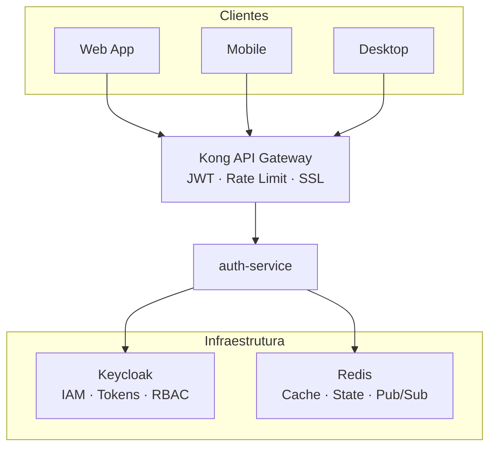

# Arquitetura do Sistema

> Contexto: [Seção 3 — Arquitetura](../../TECHNICAL_BASE.md#3-arquitetura)

---

## Visão Geral

O projeto segue uma arquitetura de microsserviços com API Gateway (Kong) na frente, Keycloak como IAM e Redis para cache/estado. Cada microsserviço é organizado internamente em camadas (adapters, application, domain, ports).

## Diagrama ASCII — Arquitetura Macro

```text
┌──────────┐  ┌──────────┐  ┌──────────┐
│  Web App │  │ Mobile   │  │ Desktop  │
└────┬─────┘  └────┬─────┘  └────┬─────┘
     │             │              │
     └──────┬──────┘──────┬───────┘
            │  HTTPS       │
            ▼              ▼
     ┌──────────────────────────┐
     │      Kong API Gateway    │
     │  (JWT, Rate Limit, SSL)  │
     └────────────┬─────────────┘
                  │
                  ▼
            ┌─────────┐
            │  auth   │
            │ service │
            └────┬────┘
                 │
           ┌─────┴─────┐
           ▼           ▼
      ┌─────────┐ ┌─────────┐
      │Keycloak │ │  Redis  │
      └─────────┘ └─────────┘
```

## Diagrama Mermaid



## Estrutura Interna do Microsserviço

Cada microsserviço segue a organização em camadas:

```text
service/
├── cmd/server/main.go          # Entrypoint
├── config/config.go            # Configuração (env vars)
├── internal/
│   ├── adapters/               # Implementações concretas
│   │   ├── http/handler.go     # Handler HTTP
│   │   ├── keycloak/client.go  # Adapter Keycloak
│   │   └── redis/state_store.go# Adapter Redis
│   ├── application/            # Use cases (lógica de negócio)
│   ├── domain/                 # Entidades e erros de domínio
│   └── ports/
│       ├── input/              # Interfaces de entrada
│       └── output/             # Interfaces de saída
└── pkg/                        # Pacotes compartilhados
```

As dependências fluem de fora para dentro: Adapters → Ports → Application → Domain. O Domain não conhece nada externo.

---

> Voltar ao índice: [README](README.md)
