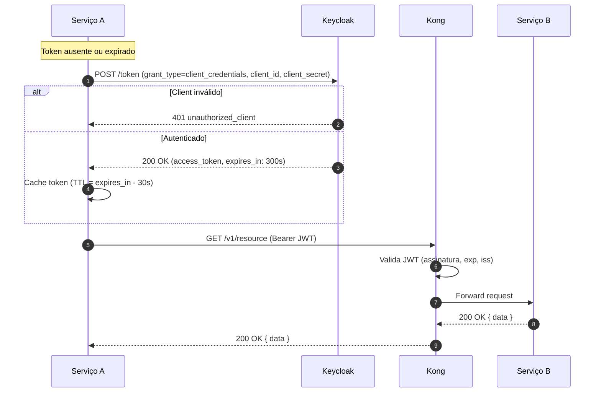

# Autenticação Service-to-Service — Client Credentials

> Contexto: [Seção 4.4 — Service-to-Service](../../TECHNICAL_BASE.md#44-service-to-service)

---

## Visão Geral

Comunicação entre serviços backend usa **OAuth 2.0 Client Credentials**. Não há usuário envolvido — cada serviço se autentica com seu próprio `client_id` e `client_secret` no Keycloak. O token é reutilizado até próximo da expiração.

## Diagrama ASCII

```text
Serviço A              Keycloak           Kong            Serviço B
    │                      │                │                  │
    │  POST /token         │                │                  │
    │  grant_type=         │                │                  │
    │  client_credentials  │                │                  │
    │  {client_id, secret} │                │                  │
    │─────────────────────>│                │                  │
    │                      │                │                  │
    │  200 OK (JWT)        │                │                  │
    │  expires_in: 300s    │                │                  │
    │<─────────────────────│                │                  │
    │                      │                │                  │
    │  Cache token local   │                │                  │
    │                      │                │                  │
    │  GET /v1/resource (Bearer JWT)        │                  │
    │──────────────────────────────────────>│                  │
    │                      │                │  Valida JWT      │
    │                      │                │  Forward request │
    │                      │                │─────────────────>│
    │                      │                │                  │
    │  200 OK { data }     │                │  200 OK { data } │
    │<─────────────────────────────────────│<─────────────────│
    │                      │                │                  │
```

## Diagrama Mermaid



## Parâmetros

| Parâmetro | Valor | Descrição |
|---|---|---|
| `grant_type` | `client_credentials` | Tipo de grant S2S |
| `client_id` | Exclusivo por serviço | Cada serviço tem seu próprio client_id |
| `client_secret` | Configurado no Keycloak | Secret do service account |
| `TTL do token` | 5 minutos | Vida máxima do token S2S |
| `Cache buffer` | 30 segundos | Renova antes de expirar |

---

> Anterior: [Refresh de Token](auth-token-refresh-flow.md)
> Voltar ao índice: [README](README.md)
