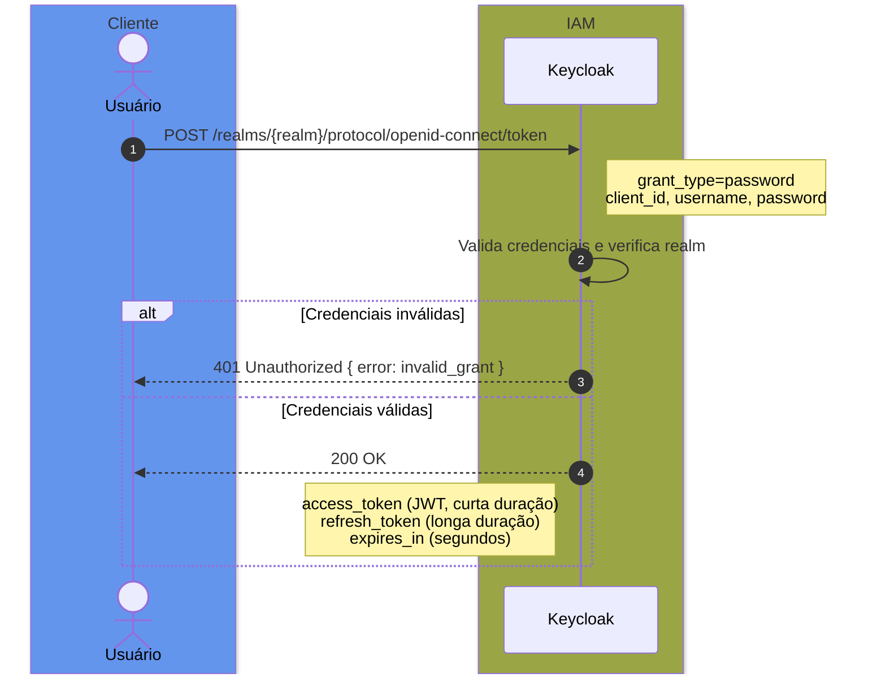
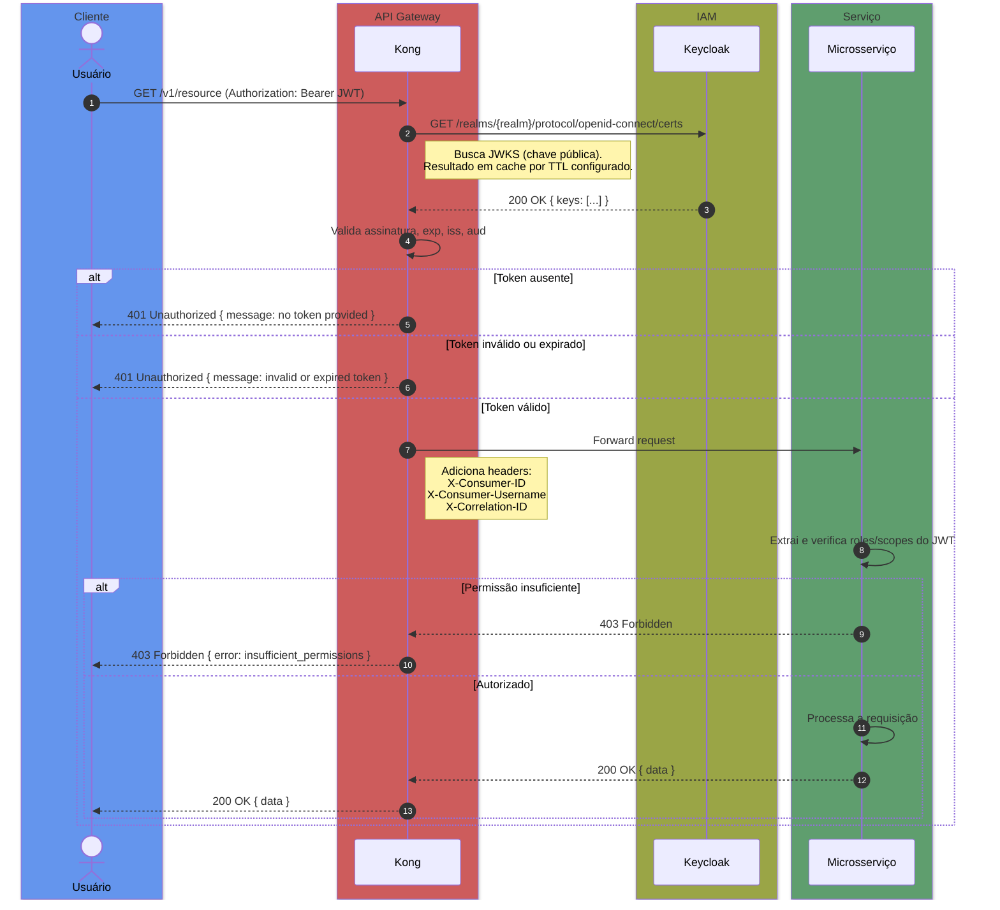

# Fluxo de Autenticação do Usuário

> Contexto: [Seção 4.1 — Autenticação e Autorização](../../TECHNICAL_BASE.md#4-autenticação-e-autorização)

---

## 4.1.a — Login (Obtenção do Token)

O usuário autentica-se diretamente no Keycloak. O Kong **não** participa do fluxo de login — ele apenas valida o token nos requests subsequentes.

---

## 4.1.b — Request Autenticado

Com o `access_token` obtido, o usuário faz requests à API. O Kong valida o JWT antes de rotear ao microsserviço destino.

---

> Próximo: [Renovação de Token](auth-token-refresh.md)
> Voltar ao índice: [README](README.md)
