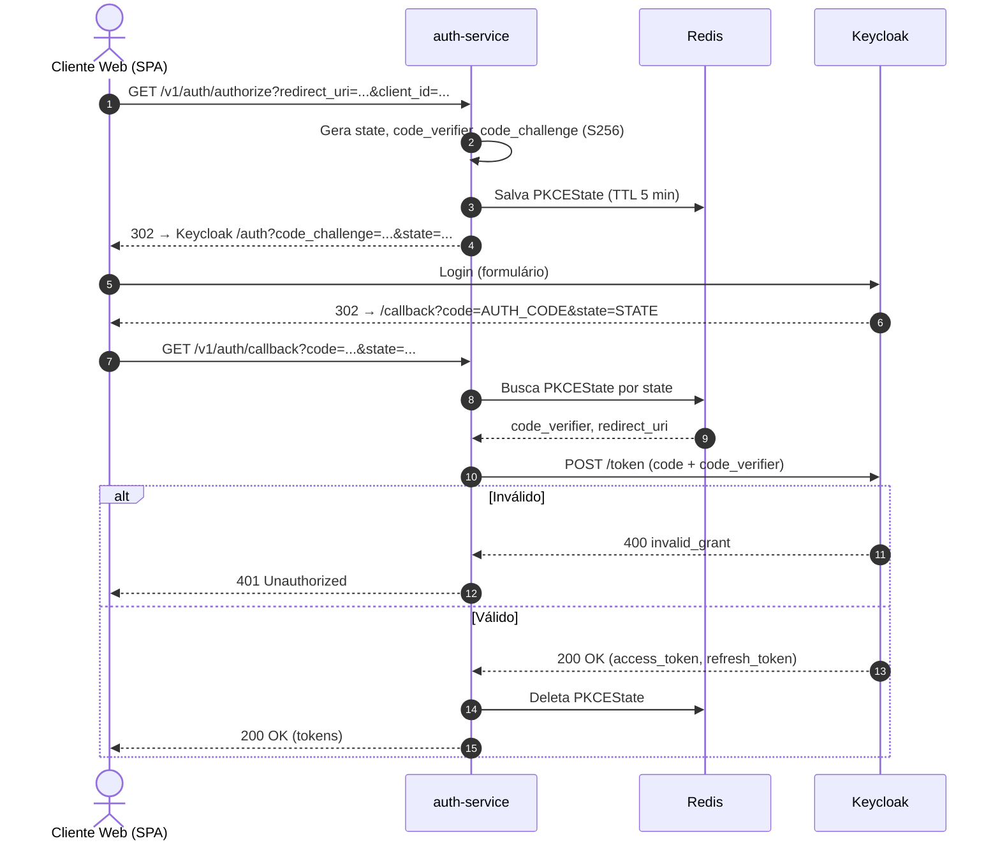

# Fluxo PKCE — Authorization Code + PKCE

> Contexto: [Seção 4 — Autenticação e Autorização](../../TECHNICAL_BASE.md#4-autenticação-e-autorização)

---

## Visão Geral

Fluxo usado por clientes web (browser/SPA). O `auth-service` gera o `code_verifier`/`code_challenge`, armazena o estado em Redis (TTL 5 min), e troca o authorization code por tokens no callback — sem expor `client_secret` ao browser.

## Diagrama ASCII

```text
Browser           auth-service         Redis          Keycloak
   │                   │                 │                │
   │  GET /authorize   │                 │                │
   │──────────────────>│                 │                │
   │                   │  Gera state +   │                │
   │                   │  code_verifier  │                │
   │                   │  + challenge    │                │
   │                   │─── Salva state ─>                │
   │                   │                 │                │
   │  302 Redirect     │                 │                │
   │<──────────────────│                 │                │
   │                   │                 │                │
   │  Login no Keycloak (com code_challenge)             │
   │─────────────────────────────────────────────────────>│
   │                   │                 │                │
   │  302 → /callback?code=xxx&state=yyy                 │
   │<────────────────────────────────────────────────────│
   │                   │                 │                │
   │  GET /callback    │                 │                │
   │──────────────────>│                 │                │
   │                   │── Busca state ──>                │
   │                   │<────────────────│                │
   │                   │                 │                │
   │                   │  POST /token (code + verifier)  │
   │                   │─────────────────────────────────>│
   │                   │<────────────────────────────────│
   │                   │                 │                │
   │                   │── Deleta state ─>                │
   │  200 OK (tokens)  │                 │                │
   │<──────────────────│                 │                │
```

## Diagrama Mermaid



## Parâmetros

| Parâmetro | Valor | Descrição |
|---|---|---|
| `code_verifier` | 64 bytes, URL-safe base64 | Segredo temporário gerado pelo auth-service |
| `code_challenge` | SHA-256(code_verifier) | Hash enviado ao Keycloak |
| `code_challenge_method` | `S256` | Método de derivação |
| `state` | 32 bytes, URL-safe base64 | Proteção CSRF |
| `PKCEState TTL` | 5 minutos | Tempo máximo entre /authorize e /callback |
| `grant_type` | `authorization_code` | Tipo de grant na troca |

---

> Anterior: [Login ROPC (mobile/app)](auth-ropc-login-flow.md)
> Próximo: [Renovação de Token](auth-token-refresh-flow.md)
> Voltar ao índice: [README](README.md)
