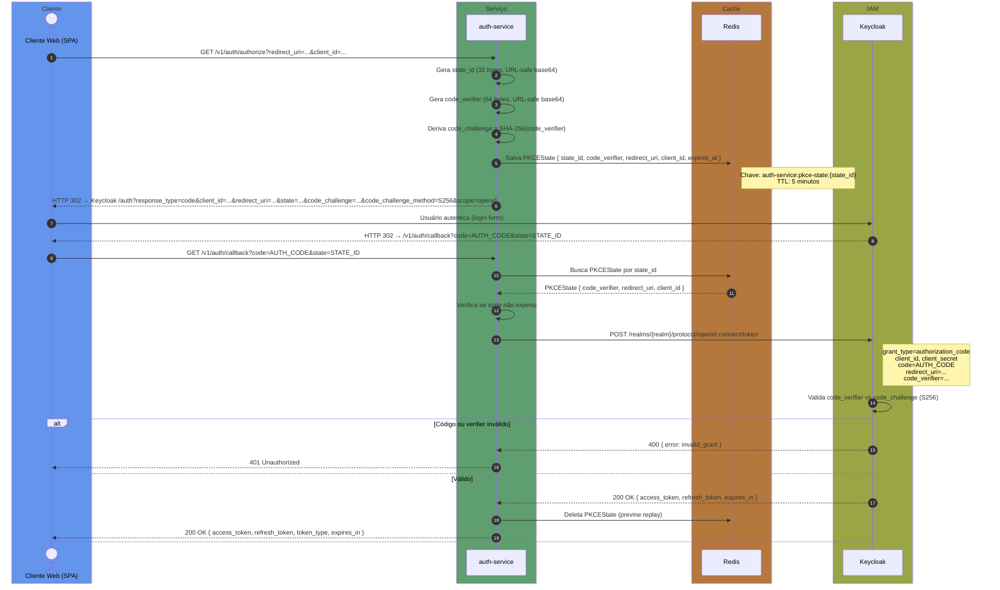

# Fluxo PKCE — Authorization Code + PKCE

> Contexto: [Seção 4 — Autenticação e Autorização](../../TECHNICAL_BASE.md#4-autenticação-e-autorização)

---

## Visão Geral

O fluxo Authorization Code + PKCE é utilizado por clientes web (browser/SPA). O `auth-service` atua como intermediário: gera o `code_verifier` e `code_challenge` no backend, armazena o estado em Redis com TTL de 5 minutos, e troca o authorization code por tokens no callback — sem expor `client_secret` ao browser.

## Diagrama ASCII

```text
┌──────────┐                  ┌──────────────┐          ┌───────────┐          ┌──────────┐
│  Cliente  │                  │ auth-service │          │   Redis   │          │ Keycloak │
│  (Web)   │                  │              │          │           │          │          │
└────┬─────┘                  └──────┬───────┘          └─────┬─────┘          └────┬─────┘
     │                               │                        │                     │
     │  1. GET /authorize            │                        │                     │
     │   ?redirect_uri=...           │                        │                     │
     │   &client_id=...             │                        │                     │
     │──────────────────────────────►│                        │                     │
     │                               │                        │                     │
     │                               │  2. Gera state_id,     │                     │
     │                               │     code_verifier,     │                     │
     │                               │     code_challenge     │                     │
     │                               │     (SHA-256 / S256)   │                     │
     │                               │                        │                     │
     │                               │  3. Salva PKCEState    │                     │
     │                               │     (TTL 5 min)        │                     │
     │                               │───────────────────────►│                     │
     │                               │                        │                     │
     │  4. HTTP 302 Redirect         │                        │                     │
     │   → Keycloak /auth            │                        │                     │
     │   ?code_challenge=...         │                        │                     │
     │   &state=...                  │                        │                     │
     │◄──────────────────────────────│                        │                     │
     │                               │                        │                     │
     │  5. Usuário autentica         │                        │                     │
     │─────────────────────────────────────────────────────────────────────────────►│
     │                               │                        │                     │
     │  6. Keycloak redireciona      │                        │                     │
     │   → /callback?code=...&state=...                       │                     │
     │◄────────────────────────────────────────────────────────────────────────────│
     │                               │                        │                     │
     │  7. GET /callback             │                        │                     │
     │   ?code=...&state=...         │                        │                     │
     │──────────────────────────────►│                        │                     │
     │                               │                        │                     │
     │                               │  8. Busca PKCEState    │                     │
     │                               │     por state_id       │                     │
     │                               │───────────────────────►│                     │
     │                               │◄───────────────────────│                     │
     │                               │                        │                     │
     │                               │  9. Verifica expiração │                     │
     │                               │     do state           │                     │
     │                               │                        │                     │
     │                               │  10. POST /token       │                     │
     │                               │   grant_type=          │                     │
     │                               │    authorization_code  │                     │
     │                               │   code=...             │                     │
     │                               │   code_verifier=...    │                     │
     │                               │   redirect_uri=...     │                     │
     │                               │───────────────────────────────────────────►│
     │                               │                        │                     │
     │                               │  11. Keycloak valida   │                     │
     │                               │   code_verifier vs     │                     │
     │                               │   code_challenge       │                     │
     │                               │◄───────────────────────────────────────────│
     │                               │                        │                     │
     │                               │  12. Deleta PKCEState  │                     │
     │                               │   (previne replay)     │                     │
     │                               │───────────────────────►│                     │
     │                               │                        │                     │
     │  13. 200 OK                   │                        │                     │
     │   { access_token,             │                        │                     │
     │     refresh_token }           │                        │                     │
     │◄──────────────────────────────│                        │                     │
     │                               │                        │                     │
```

## Diagrama Mermaid



## Parâmetros / Configuração

| Parâmetro | Valor | Descrição |
|---|---|---|
| `code_verifier` | 64 bytes, URL-safe base64 | String aleatória gerada pelo auth-service |
| `code_challenge` | SHA-256(code_verifier) | Hash enviado ao Keycloak no `/auth` |
| `code_challenge_method` | `S256` | Método de derivação do challenge |
| `state` | 32 bytes, URL-safe base64 | Proteção CSRF, vincula `/authorize` ao `/callback` |
| `PKCEState TTL` | 5 minutos | Tempo máximo entre `/authorize` e `/callback` |
| `grant_type` | `authorization_code` | Tipo de grant usado na troca de código |
| `scope` | `openid` | Scope padrão solicitado ao Keycloak |
| `Redis key` | `auth-service:pkce-state:{state_id}` | Chave de armazenamento do estado PKCE |

---

> Anterior: [Login ROPC (mobile/app)](auth-ropc-login-flow.md)
> Próximo: [Renovação de Token](auth-token-refresh-flow.md)
> Voltar ao índice: [README](README.md)
