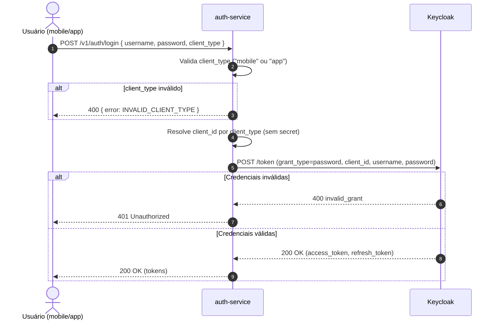

# Fluxo ROPC — Resource Owner Password Credentials

> Contexto: [Seção 4 — Autenticação e Autorização](../../TECHNICAL_BASE.md#4-autenticação-e-autorização)

---

## Visão Geral

Fluxo usado por clientes mobile (iOS/Android) e desktop/CLI. O cliente envia username e password ao `auth-service`, que repassa ao Keycloak via `POST /token` com `grant_type=password`. Clientes mobile e app usam `client_id` público (sem `client_secret`).

## Diagrama ASCII

```text
App (mobile/desktop)     auth-service         Keycloak
       │                      │                   │
       │  POST /login         │                   │
       │  {username, password,│                   │
       │   client_type}       │                   │
       │─────────────────────>│                   │
       │                      │                   │
       │                      │  Valida client_type
       │                      │  Resolve client_id │
       │                      │                   │
       │                      │  POST /token      │
       │                      │  grant_type=password
       │                      │  {client_id,      │
       │                      │   username, pass}  │
       │                      │──────────────────>│
       │                      │                   │
       │                      │  [Inválido]       │
       │  401 Unauthorized    │  400 invalid_grant│
       │<─────────────────────│<──────────────────│
       │                      │                   │
       │                      │  [Válido]         │
       │  200 OK (tokens)     │  200 OK (tokens)  │
       │<─────────────────────│<──────────────────│
       │                      │                   │
```

## Diagrama Mermaid



## Parâmetros

| Parâmetro | Valor | Descrição |
|---|---|---|
| `grant_type` | `password` | Tipo de grant ROPC |
| `client_type` | `mobile` ou `app` | Determina o client_id usado |
| `client_id` | Configurado por tipo | Clientes públicos (sem secret) |
| `scope` | `openid` | Scope padrão |

---

> Anterior: [Fluxo PKCE (web)](auth-pkce-flow.md)
> Próximo: [Renovação de Token](auth-token-refresh-flow.md)
> Voltar ao índice: [README](README.md)
