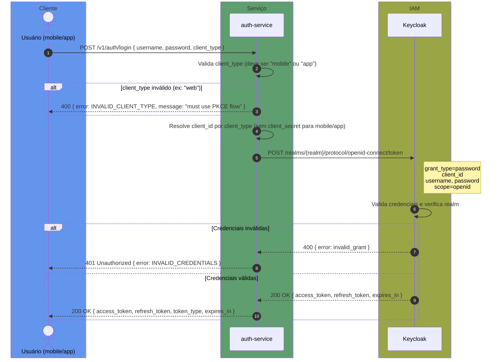
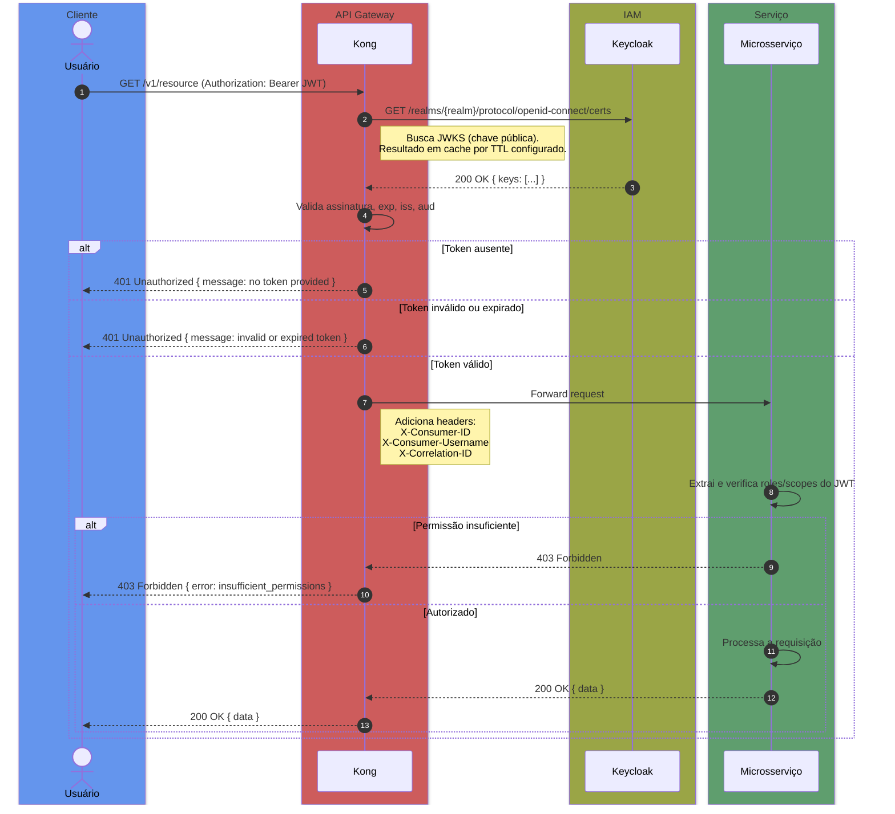

# Fluxo ROPC — Resource Owner Password Credentials

> Contexto: [Seção 4 — Autenticação e Autorização](../../TECHNICAL_BASE.md#4-autenticação-e-autorização)

---

## Visão Geral

O fluxo ROPC (`grant_type=password`) é utilizado por clientes mobile (iOS/Android) e desktop/CLI (app). O cliente envia username e password diretamente ao `auth-service`, que repassa ao Keycloak via `POST /token`. Clientes mobile e app usam `client_id` público (sem `client_secret`). O Kong **não** participa do fluxo de login — ele apenas valida o token nos requests subsequentes.

## Diagrama ASCII

```text
┌──────────┐                  ┌──────────────┐                  ┌──────────┐
│  Cliente  │                  │ auth-service │                  │ Keycloak │
│(mobile/  │                  │              │                  │          │
│  app)    │                  │              │                  │          │
└────┬─────┘                  └──────┬───────┘                  └────┬─────┘
     │                               │                               │
     │  1. POST /login               │                               │
     │   { username, password,       │                               │
     │     client_type: "mobile" }   │                               │
     │──────────────────────────────►│                               │
     │                               │                               │
     │                               │  2. Valida client_type        │
     │                               │     (deve ser mobile ou app)  │
     │                               │                               │
     │                               │  3. Resolve client_id         │
     │                               │     por client_type           │
     │                               │     (sem client_secret)       │
     │                               │                               │
     │                               │  4. POST /token               │
     │                               │   grant_type=password         │
     │                               │   client_id=...               │
     │                               │   username=...                │
     │                               │   password=...                │
     │                               │   scope=openid                │
     │                               │──────────────────────────────►│
     │                               │                               │
     │                               │  5. Keycloak valida           │
     │                               │     credenciais e realm       │
     │                               │                               │
     │                               │  [Credenciais inválidas]      │
     │                               │◄──────────────────────────────│
     │  401 { error: invalid_grant } │   400 { error: invalid_grant }│
     │◄──────────────────────────────│                               │
     │                               │                               │
     │                               │  [Credenciais válidas]        │
     │                               │◄──────────────────────────────│
     │  200 OK                       │   200 { access_token,         │
     │  { access_token,              │         refresh_token }       │
     │    refresh_token,             │                               │
     │    expires_in }               │                               │
     │◄──────────────────────────────│                               │
     │                               │                               │
```

## 4.1.a — Login (Obtenção do Token)



---

## 4.1.b — Request Autenticado

Com o `access_token` obtido, o usuário faz requests à API. O Kong valida o JWT antes de rotear ao microsserviço destino.



## Parâmetros / Configuração

| Parâmetro | Valor | Descrição |
|---|---|---|
| `grant_type` | `password` | Tipo de grant ROPC |
| `client_type` | `mobile` ou `app` | Tipo de cliente (determina o `client_id`) |
| `client_id` | Configurado por tipo | Mobile e app usam client_id público (sem secret) |
| `client_secret` | Vazio para mobile/app | Clientes públicos não possuem secret |
| `scope` | `openid` | Scope padrão solicitado ao Keycloak |

---

> Anterior: [Fluxo PKCE (web)](auth-pkce-flow.md)
> Próximo: [Renovação de Token](auth-token-refresh-flow.md)
> Voltar ao índice: [README](README.md)
