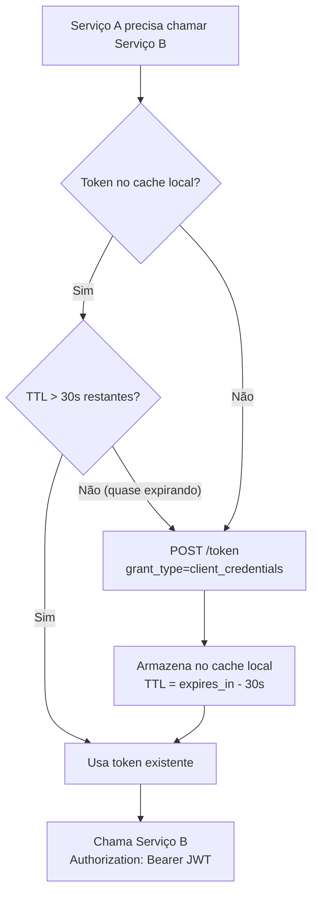

# Autenticação Service-to-Service

> Contexto: [Seção 4.4 — Service-to-Service](../../TECHNICAL_BASE.md#44-service-to-service)

---

## Visão Geral

Comunicação entre microsserviços usa o fluxo **OAuth 2.0 Client Credentials**. Nenhum usuário está envolvido — cada serviço autentica-se com seu próprio `client_id` e `client_secret` configurados no Keycloak.

Regras obrigatórias:
- Cada serviço tem um `client_id` exclusivo no Keycloak
- O token obtido é **reutilizado** até próximo da expiração (não solicitar um novo token por request)
- TTL máximo do token de service account: **5 minutos**
- A chamada entre serviços **passa pelo Kong** (mesma validação JWT do fluxo de usuário)

---

## Diagrama de Sequência

```mermaid
sequenceDiagram
    autonumber

    box rgb(100, 149, 237) Caller
        participant SvcA as Serviço A
    end
    box rgb(154, 165, 70) IAM
        participant Keycloak as Keycloak
    end
    box rgb(205, 92, 92) API Gateway
        participant Kong as Kong
    end
    box rgb(95, 158, 110) Callee
        participant SvcB as Serviço B
    end

    Note over SvcA: Token ausente ou expirado no cache local

    SvcA->>+Keycloak: POST /realms/{realm}/protocol/openid-connect/token
    Note right of Keycloak: grant_type=client_credentials<br/>client_id=svc-a<br/>client_secret=***

    alt Client inválido ou secret incorreto
        Keycloak-->>-SvcA: 401 Unauthorized { error: unauthorized_client }
    else Autenticado com sucesso
        Keycloak-->>-SvcA: 200 OK
        Note left of Keycloak: access_token (JWT)<br/>expires_in: 300s<br/>token_type: Bearer
        SvcA->>SvcA: Armazena token em cache local (TTL = expires_in - 30s)
    end

    SvcA->>+Kong: GET /v1/resource (Authorization: Bearer JWT)
    Note right of Kong: Kong valida JWT:<br/>assinatura, exp, iss, aud<br/>scope: service_account
    Kong->>+SvcB: Forward request + headers de contexto

    SvcB->>SvcB: Verifica roles do service account no JWT

    alt Sem permissão de service account
        SvcB-->>Kong: 403 Forbidden
        Kong-->>SvcA: 403 Forbidden
    else Autorizado
        SvcB->>SvcB: Processa requisição
        SvcB-->>-Kong: 200 OK { data }
        Kong-->>-SvcA: 200 OK { data }
        Note over SvcA: Token reutilizado nos próximos<br/>requests até cache expirar.
    end
```

---

## Estratégia de Cache do Token



O buffer de 30 segundos evita usar um token que expira durante o trânsito do request.

---

> Anterior: [Refresh de Token](auth-token-refresh.md)
> Voltar ao índice: [README](README.md)
