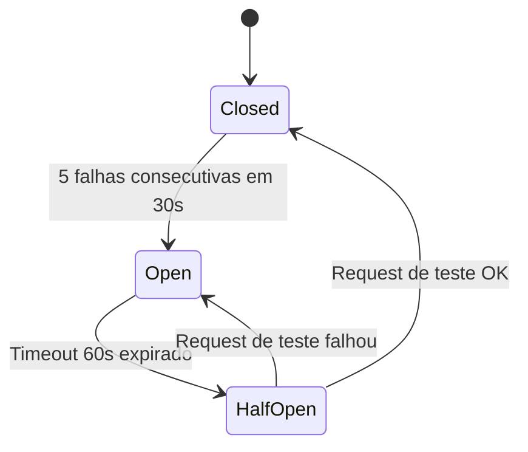

# Circuit Breaker — Estados e Transições

> Contexto: [Seção 8.2 — Escalabilidade](../../TECHNICAL_BASE.md#82-escalabilidade)

---

## Visão Geral

Padrão de resiliência que protege um serviço de chamadas repetidas a uma dependência falhando. Abre o circuito após um limiar de falhas, evitando sobrecarga e permitindo recuperação.

## Diagrama ASCII

```text
                ┌──────────────────────┐
                │       CLOSED         │
                │   (operação normal)  │
                │                      │
                │  Sucesso → zera      │
                │  Falha → incrementa  │
                └──────────┬───────────┘
                           │
                  5 falhas em 30s
                           │
                           ▼
                ┌──────────────────────┐
                │        OPEN          │
                │  (circuito aberto)   │
                │                      │
                │  Requests rejeitados │
                │  imediatamente       │
                └──────────┬───────────┘
                           │
                    timeout 60s
                           │
                           ▼
                ┌──────────────────────┐
                │      HALF-OPEN       │
                │  (teste recuperação) │
                │                      │
                │  Permite 1 request   │
                └─────┬──────────┬─────┘
                      │          │
              Teste OK│          │Teste falhou
                      ▼          ▼
                   CLOSED      OPEN
```

## Diagrama Mermaid



## Parâmetros

| Parâmetro | Valor | Descrição |
|---|---|---|
| `failure_threshold` | 5 | Falhas consecutivas para abrir |
| `failure_window` | 30s | Janela de contagem |
| `open_timeout` | 60s | Espera antes de testar |
| `success_threshold` | 1 | Sucessos para fechar |

---

> Voltar ao índice: [README](README.md)
