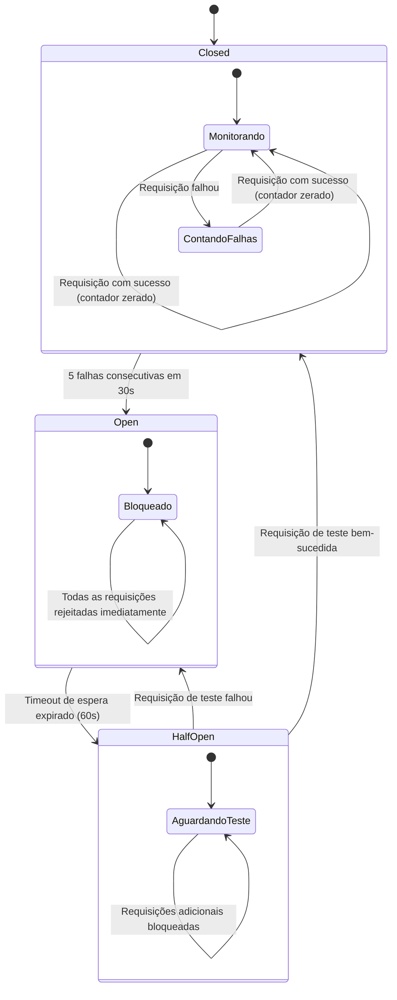
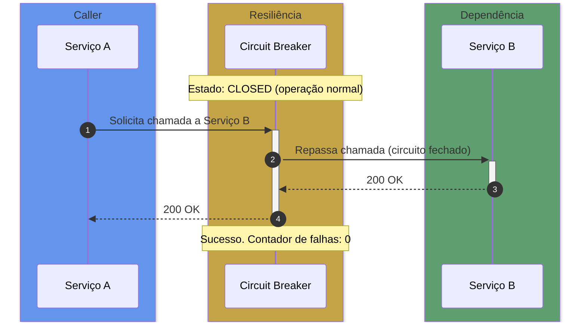
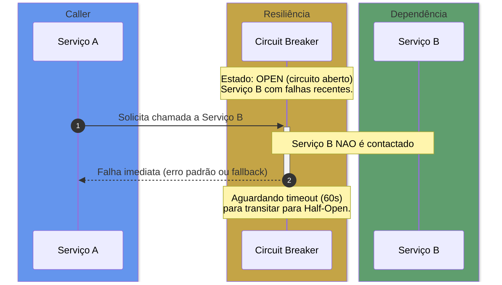
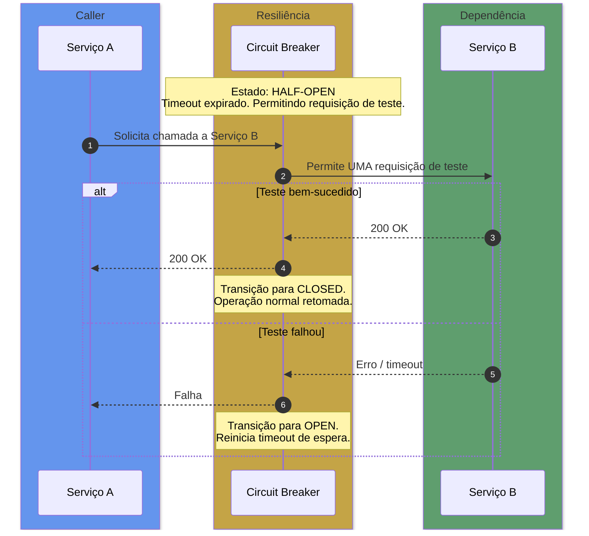

# Circuit Breaker — Estados e Transições

> Contexto: [Seção 8.2 — Escalabilidade](../../TECHNICAL_BASE.md#82-escalabilidade)

---

## Visão Geral

O Circuit Breaker é um padrão de resiliência que protege um serviço de realizar chamadas repetidas a uma dependência que está falhando. Ele "abre o circuito" após um limiar de falhas, evitando sobrecarga e permitindo recuperação.

Threshold padrão deste projeto: **5 falhas consecutivas em 30 segundos**.

---

## Diagrama ASCII — Estados e Transições

```text
                    ┌─────────────────────────────────┐
                    │           CLOSED                 │
                    │      (operação normal)           │
                    │                                  │
                    │  Sucesso → contador zerado       │
                    │  Falha   → incrementa contador   │
                    └──────────────┬──────────────────┘
                                   │
                          5 falhas em 30s
                                   │
                                   ▼
                    ┌─────────────────────────────────┐
                    │            OPEN                  │
                    │    (circuito aberto)             │
                    │                                  │
                    │  Todas as requisições            │
                    │  rejeitadas imediatamente        │
                    └──────────────┬──────────────────┘
                                   │
                         timeout 60s expirado
                                   │
                                   ▼
                    ┌─────────────────────────────────┐
                    │         HALF-OPEN                │
                    │    (teste de recuperação)        │
                    │                                  │
                    │  Permite UMA requisição teste    │
                    └───────┬─────────────┬───────────┘
                            │             │
                   Teste OK │             │ Teste falhou
                            │             │
                            ▼             ▼
                        CLOSED          OPEN
                     (retoma normal)  (reinicia timeout)
```

## Diagrama de Estados



---

## Diagrama de Sequência — Comportamento por Estado

### Estado Closed (circuito fechado — operação normal)



### Estado Open (circuito aberto — falhas acima do threshold)



### Estado Half-Open (teste de recuperação)



---

## Parâmetros de Configuração

| Parâmetro | Valor padrão | Descrição |
|---|---|---|
| `failure_threshold` | 5 | Número de falhas consecutivas para abrir o circuito |
| `failure_window` | 30s | Janela de tempo para contabilizar falhas |
| `open_timeout` | 60s | Tempo aguardado no estado Open antes de testar Half-Open |
| `success_threshold` | 1 | Sucessos consecutivos em Half-Open para fechar o circuito |

---

## Comportamento de Fallback Recomendado

Quando o circuito está **Open**, o serviço deve retornar uma resposta degradada aceitável (fallback), nunca simplesmente propagar o erro ao cliente:

- Retornar dados do cache (se disponível no Redis)
- Retornar resposta padrão/vazia com status `503 Service Unavailable`
- Enfileirar a operação para retry posterior via Redis Pub/Sub

---

> Voltar ao índice: [README](README.md)
