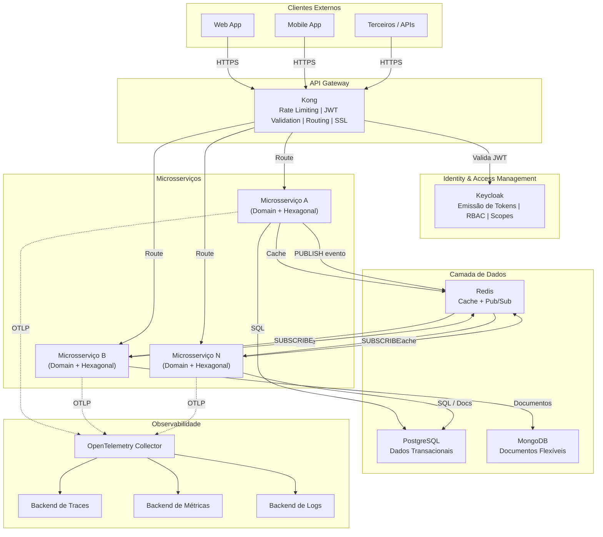
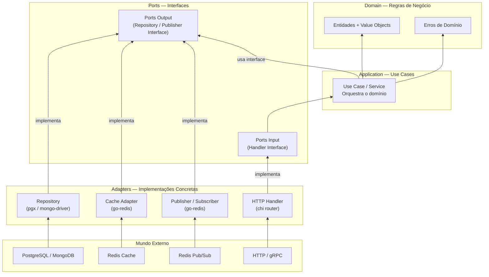
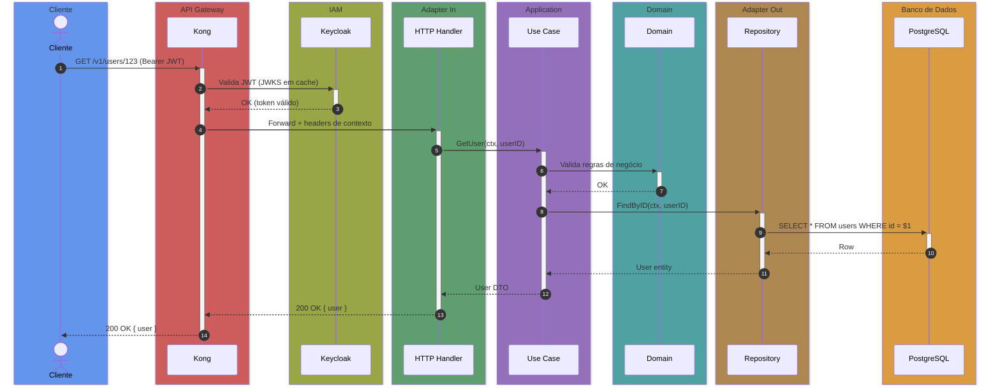

# Arquitetura do Sistema

> Contexto: [Seção 3 — Arquitetura](../../TECHNICAL_BASE.md#3-arquitetura)

---

## Visão Macro

Diagrama completo mostrando a comunicação entre clientes, API Gateway, IAM, microsserviços, bancos de dados e observabilidade.

### Diagrama ASCII — Visão Macro

```text
┌──────────┐  ┌──────────┐  ┌──────────┐
│  Web App │  │ Mobile   │  │ Terceiros│
└────┬─────┘  └────┬─────┘  └────┬─────┘
     │             │              │
     └──────┬──────┘──────┬───────┘
            │  HTTPS       │
            ▼              ▼
     ┌──────────────────────────┐
     │      Kong API Gateway    │
     │  (JWT, Rate Limit, SSL)  │
     └──────┬───────────────────┘
            │
   ┌────────┼────────────────┐
   │        │                │
   │   ┌────┴────┐           │
   │   │Keycloak │           │
   │   │  (IAM)  │           │
   │   └─────────┘           │
   │                         │
   ▼         ▼               ▼
┌─────────┐ ┌─────────┐ ┌─────────┐
│  Svc A  │ │  Svc B  │ │  Svc N  │
│(Hexagon)│ │(Hexagon)│ │(Hexagon)│
└────┬────┘ └────┬────┘ └────┬────┘
     │           │            │
┌────┴────┐ ┌────┴────┐ ┌────┴────┐
│PostgreSQL│ │ MongoDB │ │PostgreSQL│
│ + Redis  │ │ + Redis │ │ + Redis  │
└──────────┘ └─────────┘ └──────────┘
```

### Diagrama Mermaid — Visão Macro



---

## Regra de Dependência — Arquitetura Hexagonal

As dependências fluem de fora para dentro. A camada de domínio é o núcleo e não conhece nada externo. As interfaces (Ports) definem contratos que os Adapters implementam.

### Diagrama ASCII — Regra de Dependência

```text
                    Mundo Externo
        ┌───────────────────────────────────┐
        │  HTTP/gRPC   DB    Cache   Queue  │
        └───────┬───────┬──────┬──────┬─────┘
                │       │      │      │
                ▼       ▼      ▼      ▼        Dependências
        ┌───────────────────────────────────┐  fluem de
        │         Adapters (concretos)      │  fora para
        │  HTTP Handler │ Repo │ Publisher  │  dentro
        └───────────────┬───────────────────┘      │
                        │ implementa               │
                        ▼                          ▼
        ┌───────────────────────────────────┐
        │      Ports (interfaces)           │
        │   Input Ports  │  Output Ports    │
        └───────────────┬───────────────────┘
                        │
                        ▼
        ┌───────────────────────────────────┐
        │     Application (Use Cases)       │
        │   Orquestra o domínio via ports   │
        └───────────────┬───────────────────┘
                        │
                        ▼
        ┌───────────────────────────────────┐
        │     Domain (Regras de Negócio)    │
        │  Entidades │ Value Objects │ Erros│
        │     *** NÃO CONHECE NADA ***     │
        │     ***    EXTERNO       ***     │
        └───────────────────────────────────┘
```

### Diagrama Mermaid — Regra de Dependência



---

## Fluxo de um Request (visão ponta a ponta)

Exemplo de um request HTTP desde o cliente até a persistência no banco.



---

> Voltar ao índice: [README](README.md)
