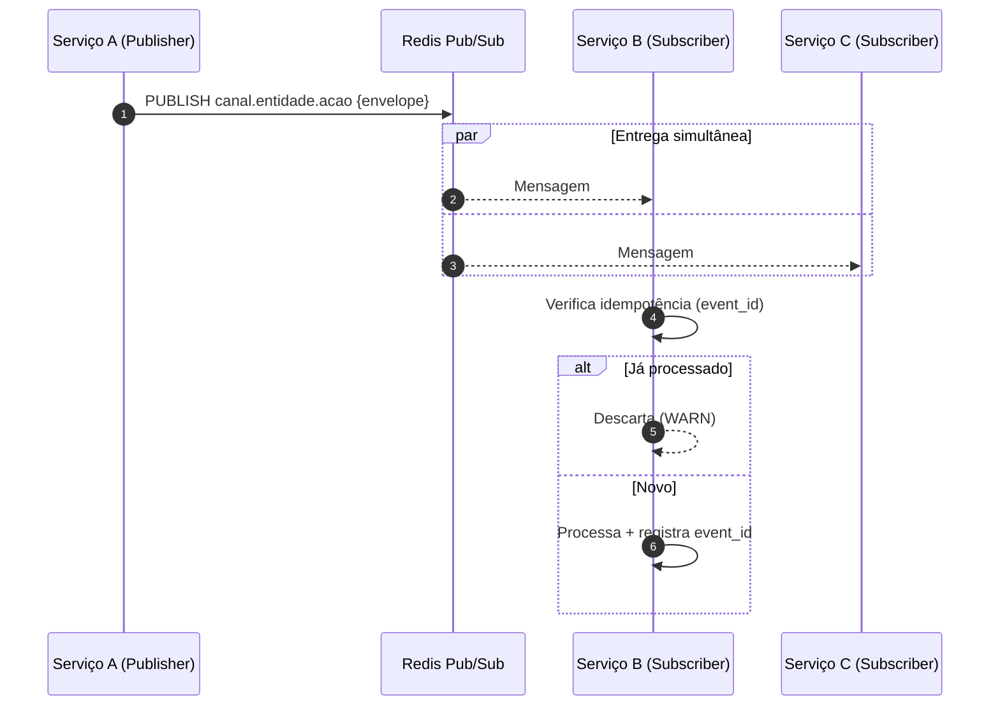

# Fluxo de Eventos Pub/Sub (Redis)

> Contexto: [Seção 3.4 — Comunicação entre Serviços](../../TECHNICAL_BASE.md#34-comunicação-entre-serviços)

---

## Visão Geral

Comunicação assíncrona entre serviços via **Redis Pub/Sub**. O Publisher publica um evento em um canal nomeado e todos os Subscribers inscritos recebem o evento. Consumidores devem ser idempotentes.

## Diagrama ASCII

```text
┌─────────────┐       ┌──────────────┐       ┌─────────────┐
│  Serviço A  │       │ Redis Pub/Sub│       │  Serviço B  │
│ (Publisher) │       │              │       │(Subscriber) │
└──────┬──────┘       └──────┬───────┘       └──────▲──────┘
       │                     │                      │
       │  PUBLISH            │                      │
       │  {event_id,         │     Mensagem         │
       │   event_type,       │─────────────────────>│
       │   source,           │                      │
       │   timestamp,        │               ┌──────▲──────┐
       │   payload}          │               │  Serviço C  │
       │────────────────────>│               │(Subscriber) │
       │                     │               └─────────────┘
       │                     │     Mensagem         │
       │                     │─────────────────────>│
       │                     │                      │
```

## Diagrama Mermaid



## Convenção de Canais

| Padrão | Exemplo |
|---|---|
| `{servico}.{entidade}.{acao}` | `user-service.user.created` |

---

> Voltar ao índice: [README](README.md)
