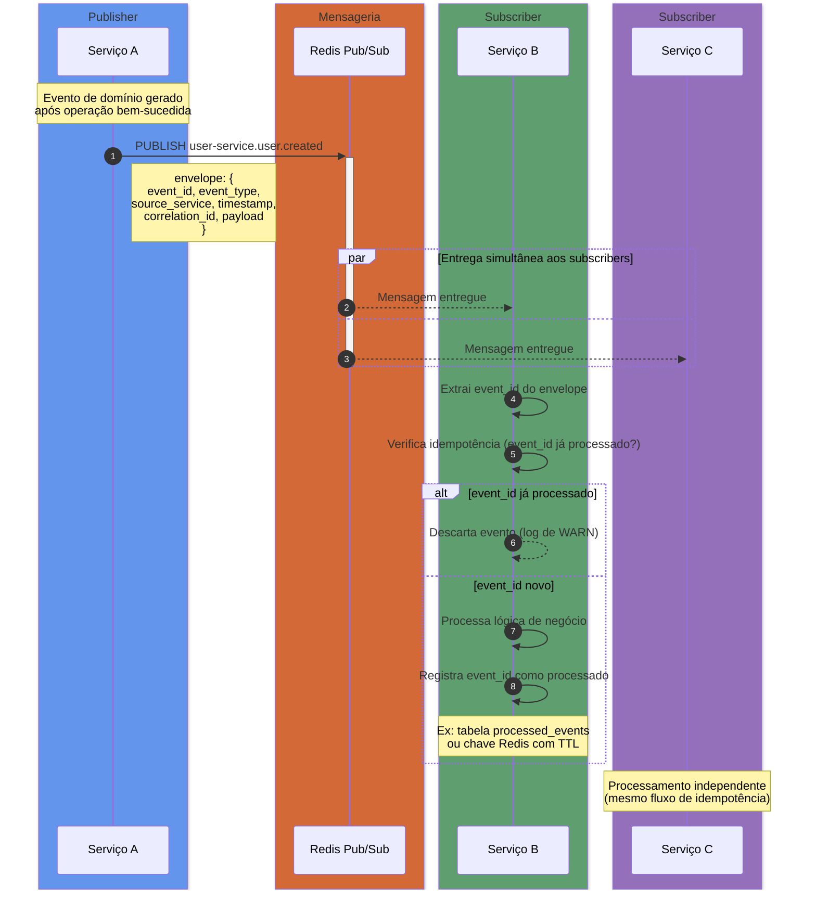
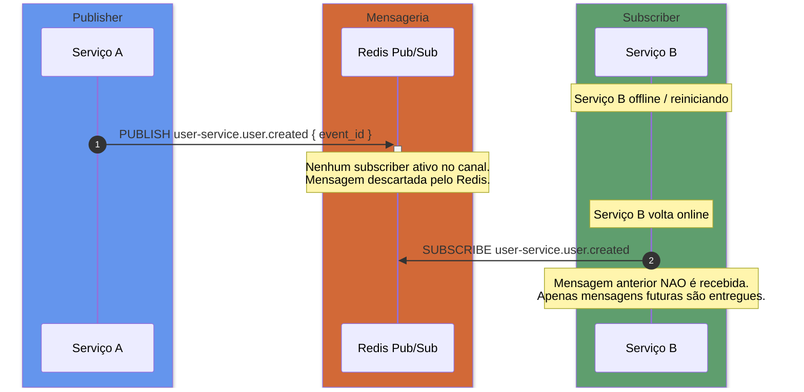

# Fluxo de Eventos Pub/Sub (Redis)

> Contexto: [Seção 3.3 — Comunicação Assíncrona](../../TECHNICAL_BASE.md#33-comunicação-entre-serviços)

---

## Visão Geral

Comunicação assíncrona entre serviços usa **Redis Pub/Sub**. O Publisher publica um evento em um canal nomeado. Todos os Subscribers inscritos naquele canal recebem o evento de forma independente.

Regras obrigatórias:
- Todo evento deve seguir o **envelope padrão** (ver `TECHNICAL_BASE.md` seção 3.3)
- Consumidores devem ser **idempotentes**: o mesmo `event_id` processado mais de uma vez deve produzir o mesmo resultado
- O canal segue o padrão: `{servico}.{entidade}.{acao}` (ex: `user-service.user.created`)

---

## Diagrama de Sequência — Publicação e Consumo

---

## Diagrama de Sequência — Falha no Consumidor

Redis Pub/Sub **não garante entrega** se o subscriber estiver offline. Para cenários que exigem garantia de entrega, avaliar o uso de **Redis Streams** como alternativa.

> **Atenção:** Para garantia de entrega (at-least-once), use **Redis Streams** com consumer groups em vez de Pub/Sub puro.

---

## Namespacing de Canais

| Padrão | Exemplo |
|---|---|
| `{servico}.{entidade}.{acao}` | `user-service.user.created` |
| `{servico}.{entidade}.{acao}` | `order-service.order.status_changed` |
| `{servico}.{entidade}.{acao}` | `payment-service.payment.confirmed` |

---

> Voltar ao índice: [README](README.md)
